# LifeOS

[](#tech-stack)
[](#tech-stack)
[](#database-design)
[](#architecture-overview)

LifeOS is a student productivity platform built to make academic work feel structured, visible, and easier to act on. It combines task management, smart prioritization, progress tracking, and lightweight social motivation into one focused workspace.

The goal is not to become another noisy social app or a generic todo list. LifeOS is designed around a simple loop:

**capture work → rank what matters most → show progress clearly → reinforce consistency**
<p align="center">
  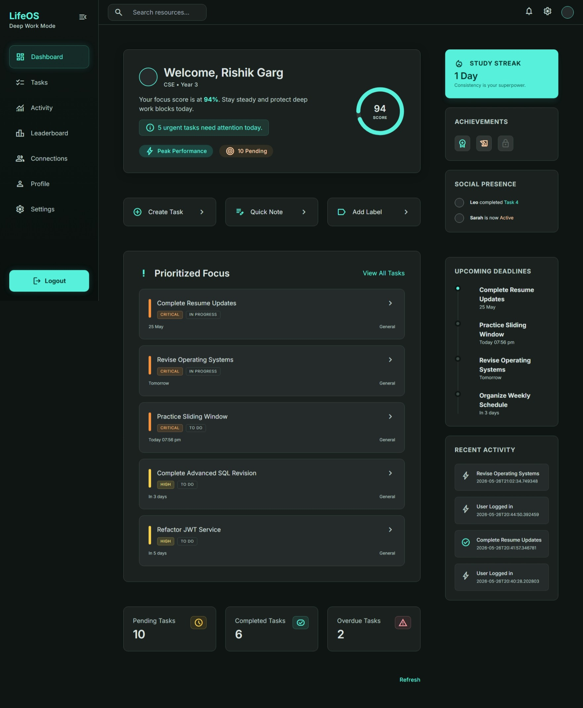
</p>

## What LifeOS is trying to solve

Most student tools fall into one of two extremes:

- task apps that store work but do not help you decide what to do next
- productivity systems that add too much gamification and lose focus

LifeOS sits in the middle. It is built for students who need:
- a clear place to manage academic tasks
- explainable task prioritization
- visible progress signals like streaks and points
- accountability through friends and scoped leaderboards
- a calm dashboard that emphasizes momentum over noise

---

## Core Product Principles

- **Backend-first**: the backend owns scoring, aggregation, and productivity logic.
- **Explainable prioritization**: task ranking always shows why a task is important.
- **Minimal social layer**: friends and leaderboards exist for accountability, not feeds.
- **Calm UI**: the interface should feel focused, not distracting.
- **Finishability over feature bloat**: every feature should support actual student workflow.

---

## Implemented Features

### 1) Authentication and Security
LifeOS uses email/password authentication with JWT-based sessions and stateless Spring Security.

Implemented capabilities:
- account registration and login
- JWT issuance and validation
- secured API access for the app shell
- centralized exception handling for auth and request failures

### 2) Student Profile System
Each user can maintain a student profile that gives the app its academic context.

Implemented capabilities:
- create and update profile data
- branch association
- college-aware discovery/search
- profile-based UI context for dashboard and connections

### 3) Task Management
Tasks are the main unit of work inside LifeOS.

Implemented capabilities:
- create, update, view, and delete tasks
- task filtering and sorting
- task status updates
- upcoming task view
- task statistics summary
- support for task types, labels, due dates, and priorities
<table>
  <tr>
    <td align="center">
      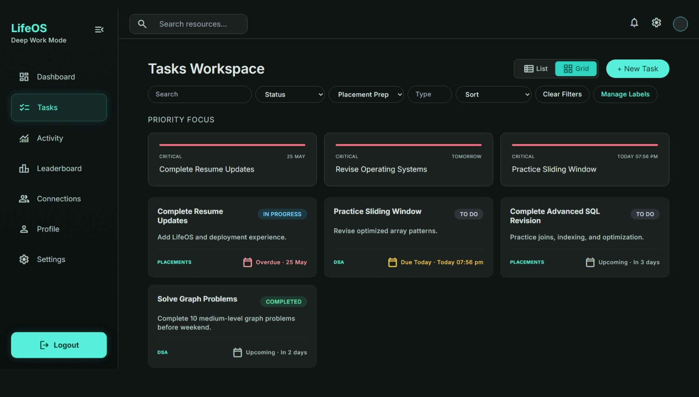
      <br />
      <strong>Task Board</strong>
    </td>
    <td align="center">
      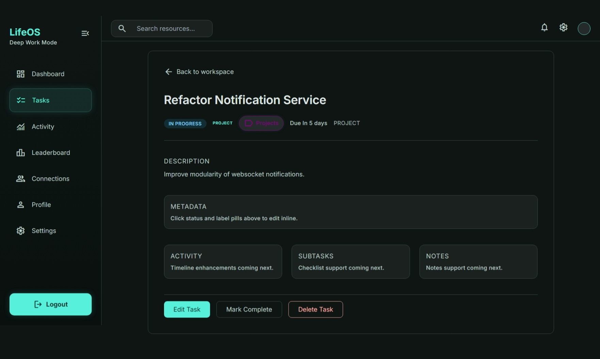
      <br />
      <strong>Task Details</strong>
    </td>
  </tr>
</table>

### 4) Smart Prioritization
LifeOS does not just show tasks; it explains what should be worked on first.

The prioritization engine weighs:
- due date proximity
- overdue status
- task status
- manual priority
- label weight

Each prioritized task returns:
- computed score
- priority level
- human-readable reasons
<p align="center">
  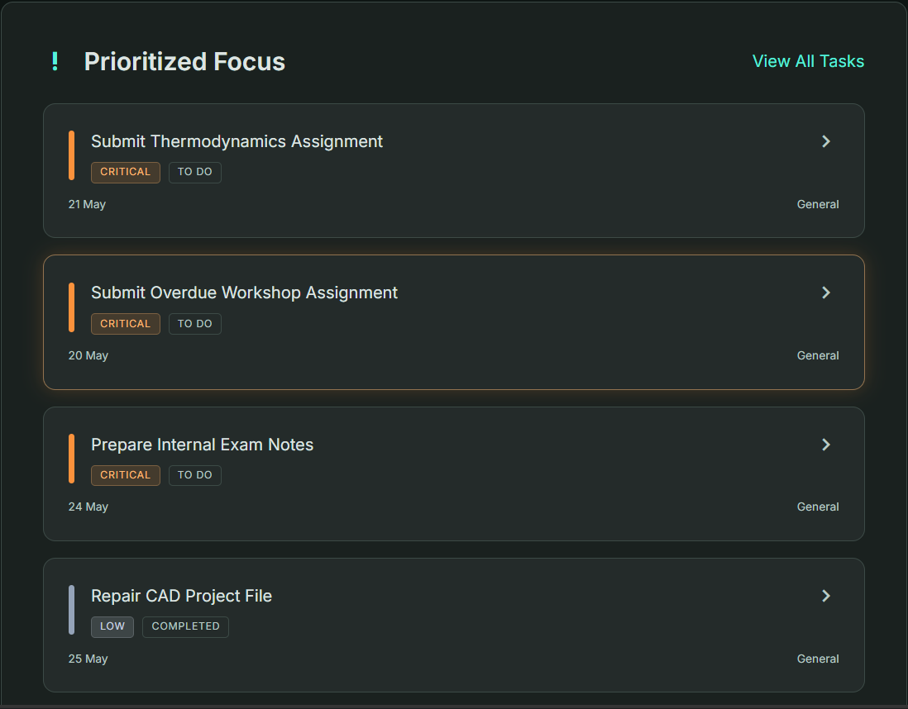
</p>

### 5) Labels and Focus Categories
Labels help the app understand what kind of work a task represents.

Implemented capabilities:
- user-owned labels
- priority weight per label
- default label seeding
- label-driven prioritization and insights
<p align="center">
  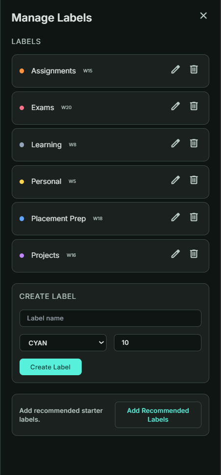
</p>

### 6) Activity Tracking
LifeOS records meaningful user events so the app can visualize behavior over time.

Implemented capabilities:
- task created / updated / completed events
- login activity
- profile update events
- activity timeline support
- social activity
- heatmap and insight generation from activity signals
<p align="center">
  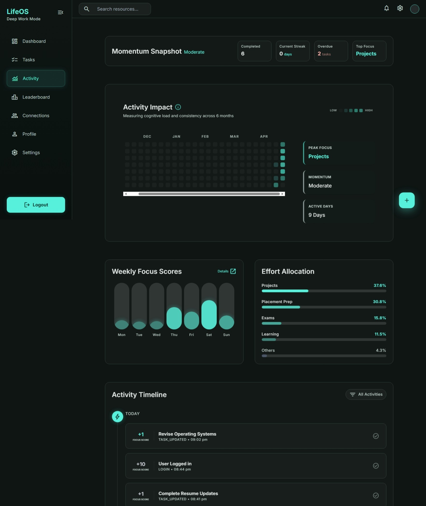
</p>

### 7) Stats, Rewards, and Streaks
Progress is tracked as a real signal, not just a visual gimmick.

Implemented capabilities:
- current user stats endpoint
- points accumulation
- current streak tracking
- longest streak tracking
- completed task counters
- reward updates when tasks are completed

### 8) Dashboard
The dashboard acts as the main “at a glance” workspace.

Implemented capabilities:
- profile summary
- task summary counts
- current streak
- prioritized tasks
- upcoming tasks
- recent activity
- aggregated response from a single endpoint
  <br />
<p align="center">
  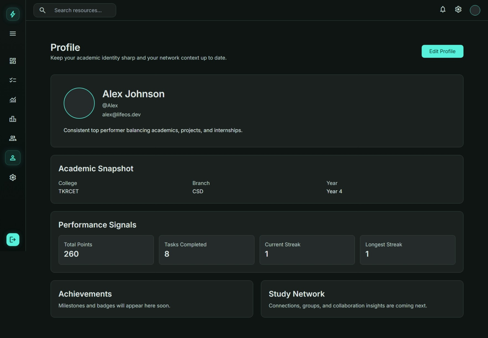
</p>

### 9) Connections and Social Accountability
LifeOS includes a lightweight social layer for peer motivation.

Implemented capabilities:
- friend requests
- accept / reject actions
- friend list management
- incoming / outgoing request views
- discovery/search for connectable users
<table>
  <tr>
    <td align="center">
      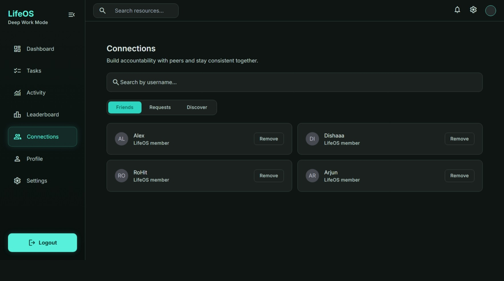
      <br />
      <strong>Friends</strong>
    </td>
    <td align="center">
      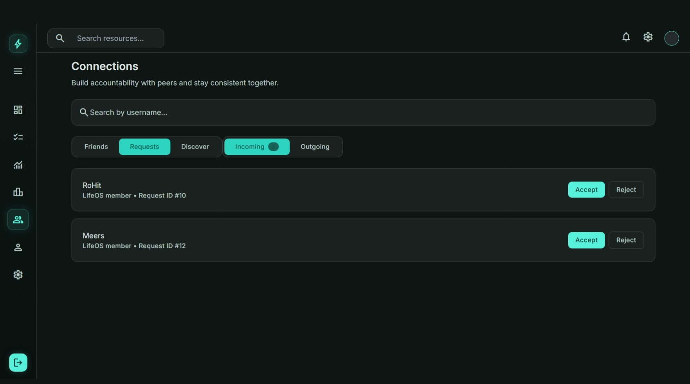
      <br />
      <strong>Requests</strong>
    </td>
    <td align="center">
      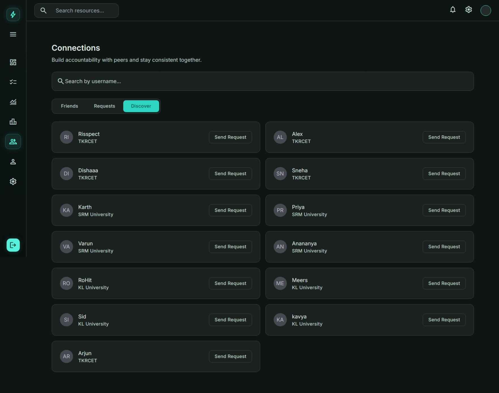
      <br />
      <strong>Discover</strong>
    </td>
  </tr>
</table>

### 10) Leaderboards
Leaderboards are used as a structured motivation system, not a social feed.

Implemented capabilities:
- global leaderboard
- friends leaderboard
- college leaderboard
- rank calculation from stored user stats
- points + streak based ordering
<table>
  <tr>
    <td align="center">
      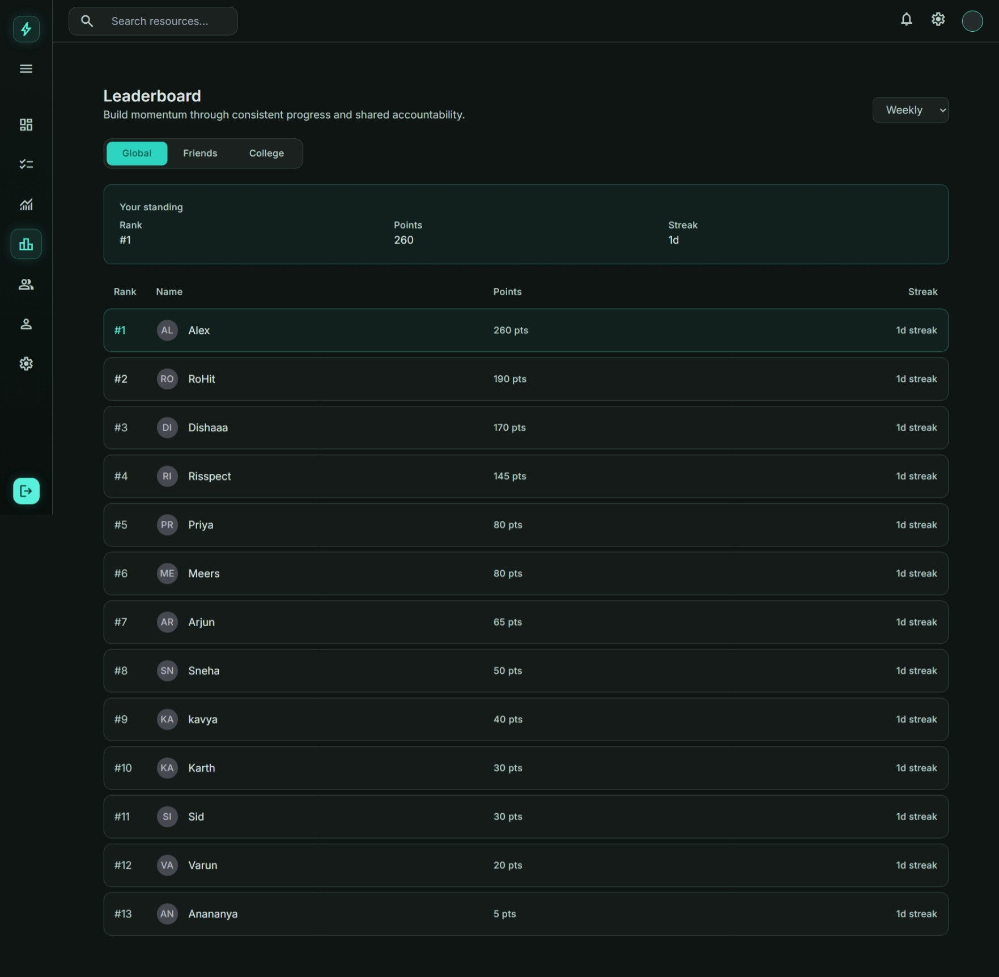
      <br />
      <strong>Global</strong>
    </td>
    <td align="center">
      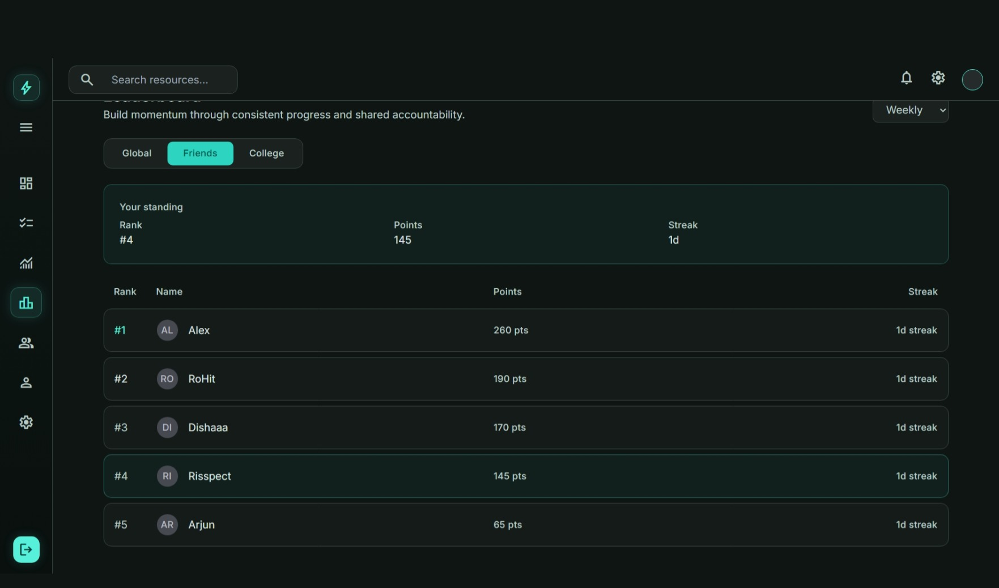
      <br />
      <strong>Friends</strong>
    </td>
    <td align="center">
      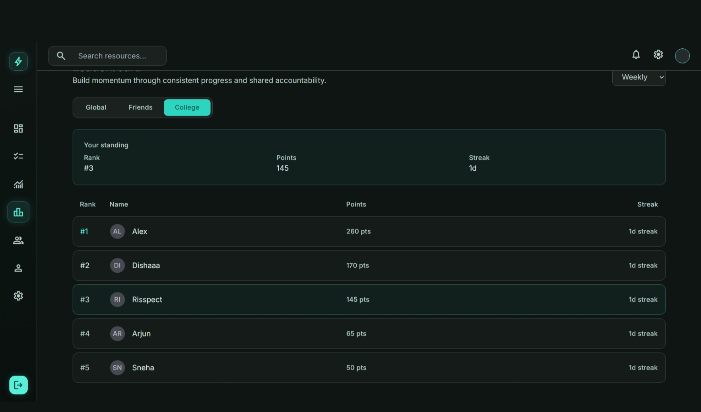
      <br />
      <strong>College</strong>
    </td>
  </tr>
</table>

### 11) Insights and Productivity Signals
LifeOS includes activity-driven insight surfaces that make progress easier to understand.

Implemented capabilities:
- productivity summary
- task heatmap
- weekly trend
- focus distribution
- activity timeline

<p align="center">
  
</p>
---

## How the App Fits Together

A typical LifeOS flow looks like this:

1. A student creates tasks for assignments, study work, and other responsibilities.
2. The prioritization engine scores each task using due dates, labels, and urgency.
3. The dashboard surfaces what matters most first.
4. Completion events update activity history, points, and streaks.
5. Stats and insights summarize consistency over time.
6. Friends and leaderboards turn that progress into accountability and motivation.

That flow keeps the app centered on action, not just storage.

---

## Tech Stack

### Backend
- Java 21
- Spring Boot 4.0.6
- Spring Security
- Spring Data JPA / Hibernate
- PostgreSQL
- JWT authentication (`jjwt`)
- MapStruct
- SpringDoc OpenAPI / Swagger
- JPA auditing via `BaseEntity`

### Frontend
- React 18
- Vite
- React Router
- Axios
- Tailwind CSS

---

## Architecture Overview

### Backend
LifeOS follows a feature-oriented modular structure. Each domain owns its own controller, service, DTOs, repositories, and related logic.

The backend is responsible for:
- business rules
- task scoring and prioritization
- reward/streak calculation
- dashboard aggregation
- leaderboard ranking
- insight generation
- authentication and authorization

DTOs and records are used to keep API contracts separate from entities. MapStruct is used where transformation should stay clean and predictable.

### Frontend
The frontend is organized around page-level routes and reusable feature components. It focuses on rendering backend-driven data cleanly rather than duplicating logic on the client.

The UI is designed to be:
- responsive
- calm
- modular
- productivity-oriented

---

## Backend Modules

Current domains in the codebase include:

- `auth` — login, registration, JWT handling
- `user` — core identity model
- `student` — student profile and discovery
- `branch` — branch metadata
- `task` — task CRUD, filtering, sorting, status updates
- `task/label` — labels and default seed data
- `task/prioritization` — priority scoring and explanation generation
- `activity` — behavior/event tracking
- `stats` — user stats, streaks, and current performance
- `rewards` — points and completion rewards
- `friend` — friendships and friend requests
- `leaderboard` — scoped rankings
- `dashboard` — aggregated overview payload
- `insights` — heatmap, trends, distribution, timeline
- `exceptions` — centralized API error handling

---

## API Highlights

Representative endpoints from the current build:

### Authentication
- `POST /register`
- `POST /login`

### Profile
- `GET /profile`
- `POST /profile`
- `PUT /profile`
- `PUT /profile/{branchId}`
- `GET /profile/all`
- `GET /profile/search?q=...`

### Tasks
- `POST /task`
- `GET /task/all`
- `GET /task/{taskId}`
- `PUT /task/{taskId}`
- `PUT /task/{taskId}/{status}`
- `GET /task`
- `GET /task/upcoming`
- `GET /task/stats`

### Prioritization
- `GET /tasks/prioritized`

### Labels
- `GET /labels`
- `POST /labels`
- `PUT /labels/{labelId}`
- `DELETE /labels/{labelId}`
- `POST /labels/defaults`

### Activity
- `GET /activities`

### Stats
- `GET /stats/me`

### Dashboard
- `GET /dashboard`

### Connections
- `POST /friends/request/{receiverId}`
- `POST /friends/request/{requestId}/accept`
- `POST /friends/request/{requestId}/reject`
- `GET /friends`
- `DELETE /friends/{friendId}`
- `GET /friends/requests/incoming`
- `GET /friends/requests/outgoing`

### Leaderboard
- `GET /leaderboard?scope=GLOBAL|FRIENDS|COLLEGE`

### Insights
- `GET /insights`

### API Docs
- `GET /swagger-ui/**`
- `GET /v3/api-docs/**`

---

## Database Design

LifeOS uses PostgreSQL with JPA entities that reflect the main product domains.

Key relationships include:
- `User` as the identity root
- `Student` as the academic profile linked one-to-one with `User`
- `Task` belonging to a user and optionally referencing labels
- `Label` belonging to a user and influencing prioritization
- `Activity` recording user actions and optionally linking to tasks
- `UserStats` storing points, streaks, and completion counters for each user
- `FriendRequest` and `Friendship` representing the connection layer

The database is designed to support both current app behavior and future expansion into more advanced productivity features.

---

## Current Product Direction

The current direction is:
- structured productivity
- explainable prioritization
- lightweight accountability
- calm analytics
- a modular backend that can grow without becoming messy

---

## Roadmap

The current roadmap builds outward from the systems already in place.

### Near-Term Additions
- richer notification and reminder flows
- websocket-based realtime updates for lightweight social or alert surfaces
- notes support for study content and task-linked reference material
- activity feed for friend progress and streak updates

### Longer-Term Intelligence
- smarter workload balancing
- burnout and consistency analysis
- adaptive prioritization based on behavior
- richer productivity insights and patterns
- recommendations that stay explainable rather than black-box

### Social and Motivation Layer
- deeper friend-aware visibility
- more granular leaderboard scopes
- optional privacy controls for comparisons
- consistency-based achievements and milestones

The intent is to expand the system without turning it into a noisy engagement product.

---

## Setup Instructions

### Prerequisites
- Java 21
- PostgreSQL
- Node.js and npm

### Backend
Configure the database and JWT settings in `src/main/resources/application.properties`.

Common environment overrides:
- `DB_URL`
- `DB_USERNAME`
- `DB_PASSWORD`

Run backend:

```bash
./mvnw spring-boot:run
```

On Windows:

```bash
./mvnw.cmd spring-boot:run
```

### Frontend
From the frontend directory:

```bash
npm install
npm run dev
```

Production build:

```bash
npm run build
```

---

## Notes

- Swagger/OpenAPI is available for exploring the backend endpoints.
- The frontend is intended to stay thin and presentation-focused, while the backend owns the meaningful logic.

---

## License

This project is licensed under the MIT License.
