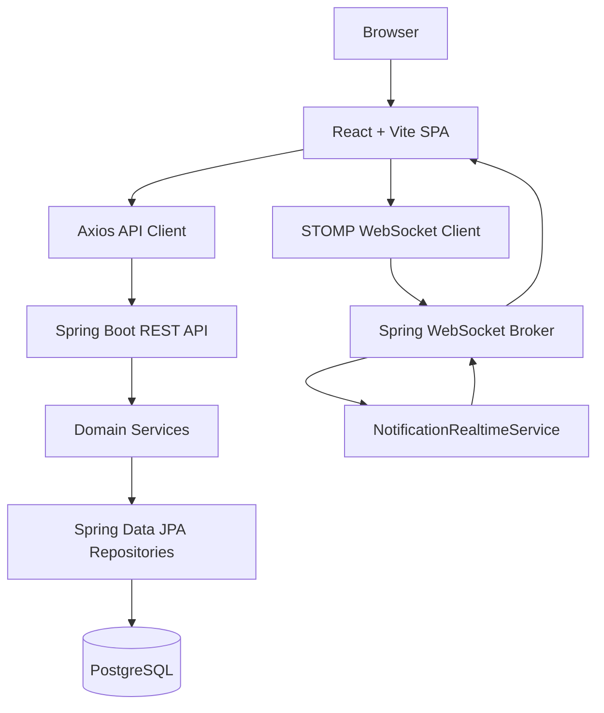
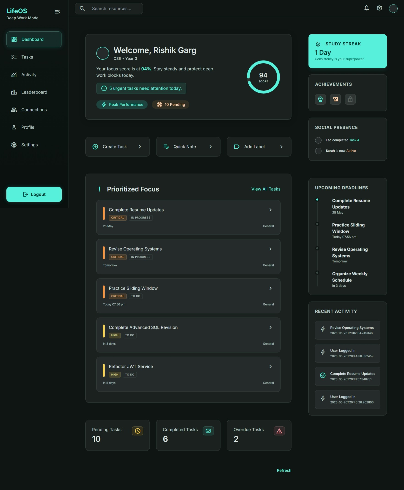
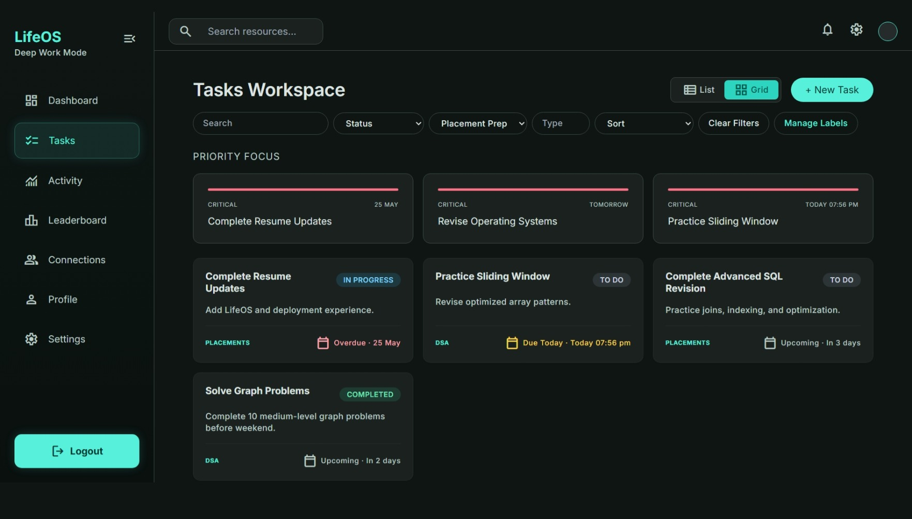
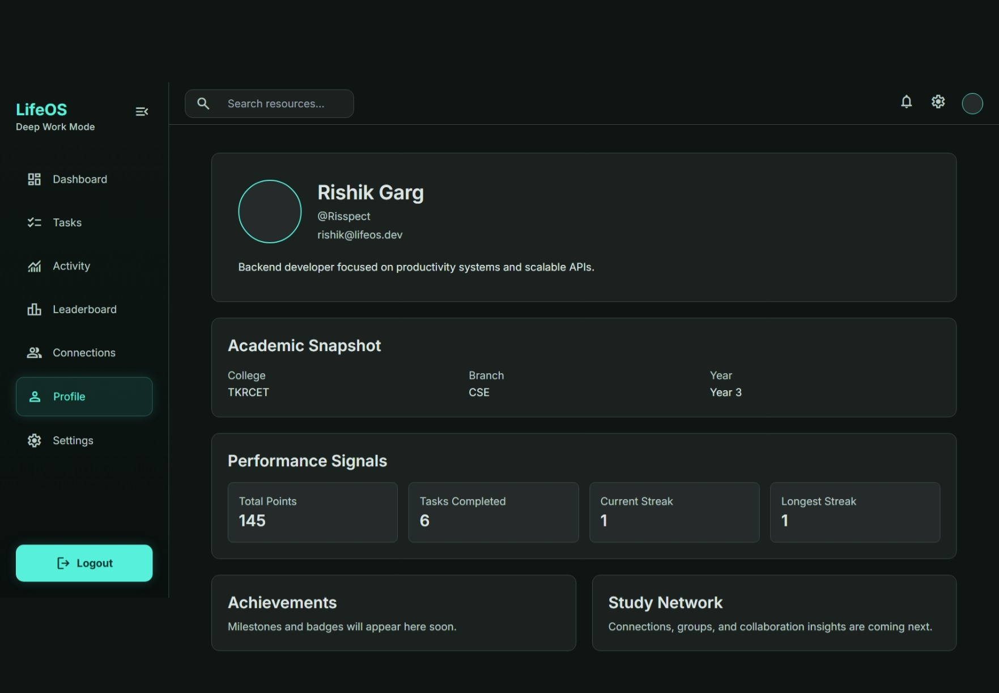
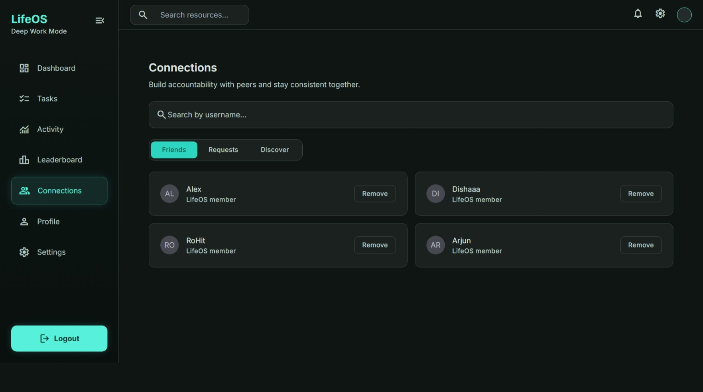
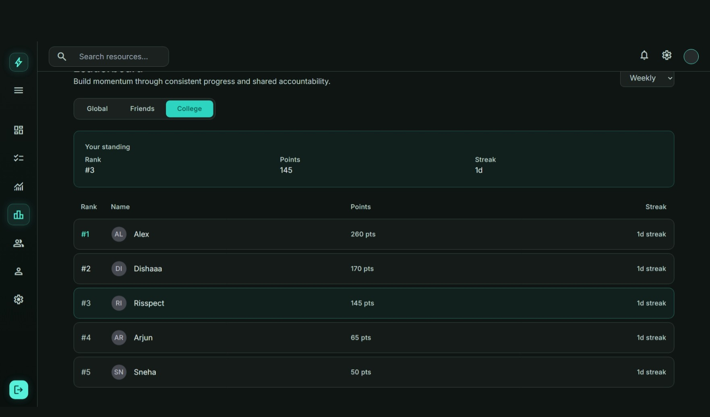
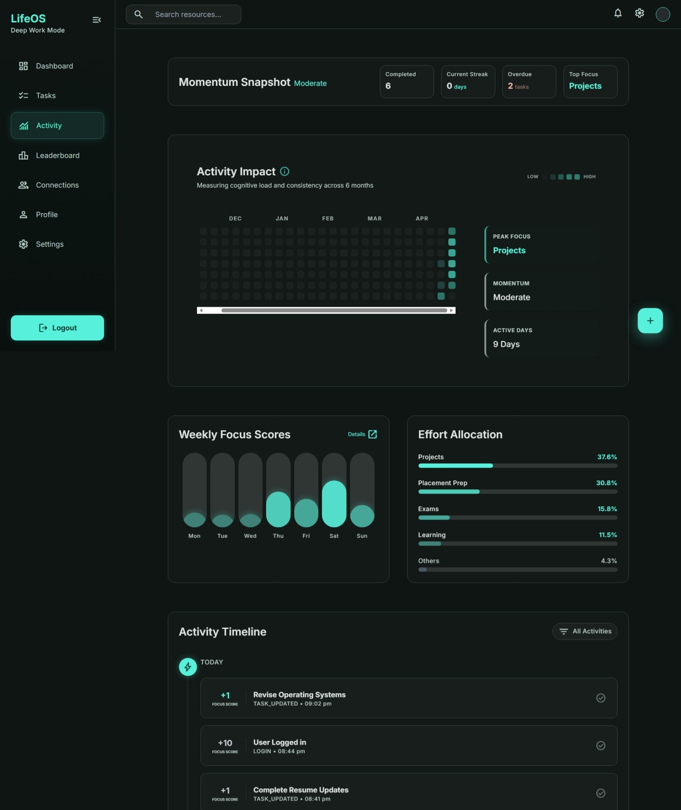

# LifeOS

[](#technology-stack)
[](#technology-stack)
[](#technology-stack)
[](LICENSE)

LifeOS is a student productivity and accountability platform for managing academic work, study notes, progress, and peer motivation in one workspace. It combines a React single-page application with a Spring Boot API, PostgreSQL persistence, JWT security, Google OAuth sign-in, STOMP WebSocket notifications, and an AI-assisted task draft workflow backed by Google Gemini.

The project is built around a simple product loop: capture work, prioritize the next useful action, track consistency, and make progress visible.

## Problem Statement

Students often manage academic work across disconnected tools: task lists, notes apps, chat threads, calendar reminders, and informal accountability groups. That fragmentation makes it hard to see what matters now, what is overdue, how consistent the student has been, and where social motivation can help.

LifeOS addresses that problem by bringing task management, focus labels, notes, smart prioritization, activity tracking, friend connections, leaderboards, and notifications into a single application.

## Motivation

LifeOS was built as a full-stack engineering project to explore how a productivity app can be designed as more than a CRUD task board. The implementation focuses on:

- A decoupled frontend/backend architecture that can be deployed independently.
- Stateless authentication that works for both credentials login and Google OAuth.
- Domain-oriented backend modules that keep task, profile, social, notification, and analytics concerns navigable.
- Real-time notifications for social events instead of repeated polling.
- A priority engine that explains why a task is ranked highly.
- Containerized local development and production-oriented deployment paths.

## Key Features

- Credentials registration and login with JWT-based authorization.
- Google OAuth login using a short-lived exchange code before issuing the application JWT.
- Student profile setup with college, branch, year, bio, and discovery support.
- Task creation, filtering, status updates, deadlines, manual priorities, and task detail views.
- Focus labels with priority weights used by the smart prioritization engine.
- Study notes that can stand alone or attach to tasks.
- Prioritized task ranking based on due date, status, manual priority, and label weight.
- Dashboard aggregation for profile, streak, stats, tasks, activity, and social state.
- Friend discovery, incoming/outgoing requests, friend lists, and social activity feeds.
- Leaderboards scoped by global, friends, or college.
- Activity insights, timeline data, productivity heatmaps, and focus distribution views.
- STOMP WebSocket notifications for user-specific real-time updates.
- Google Gemini integration for AI-generated task drafts.
- Dockerfiles and Docker Compose for local containerized execution.

## Live Demo

A public demo URL is not stored in this repository. When deployed, add the hosted frontend URL here.

- Frontend: `https://life-os-rho-liard.vercel.app/`
- Backend health/API base: `https://lifeos-kycz.onrender.com/swagger-ui/index.html`

## Swagger Documentation

The backend includes SpringDoc OpenAPI UI.

- Local Swagger UI: `http://localhost:8080/swagger-ui/index.html`
- Local OpenAPI JSON: `http://localhost:8080/v3/api-docs`

Do not manually maintain a duplicate endpoint catalog outside Swagger. The API documentation in this repository explains API organization, authentication expectations, and how to use the generated Swagger UI.

## Documentation Index

Start with [docs/README.md](docs/README.md) for the full documentation map.

| Area | Document |
| --- | --- |
| Architecture | [System Architecture](docs/architecture.md) |
| Backend | [Backend Guide](docs/backend.md) |
| Frontend | [Frontend Guide](docs/frontend.md) |
| Authentication | [Authentication](docs/authentication.md) |
| API | [API Guide](docs/api.md) |
| Database | [Database](docs/database.md) |
| WebSockets | [WebSockets](docs/websocket.md) |
| Docker | [Docker](docs/docker.md) |
| Deployment | [Deployment](docs/deployment.md) |
| Project Structure | [Project Structure](docs/project-structure.md) |
| Engineering Decisions | [Engineering Decisions](docs/engineering-decisions.md) |

## Technology Stack

### Backend

- Java 21
- Spring Boot 4.0.6
- Spring Security
- Spring Data JPA and Hibernate
- PostgreSQL
- SpringDoc OpenAPI / Swagger UI
- Spring WebSocket with STOMP
- JJWT
- MapStruct
- Lombok
- Bucket4j
- Caffeine
- Google GenAI client

### Frontend

- React 18
- Vite 5
- React Router 6
- Axios
- Tailwind CSS
- `@stomp/stompjs`
- `sockjs-client` dependency is present, though the current WebSocket client uses native STOMP broker URLs.

### Infrastructure

- Docker
- Docker Compose
- Nginx for the production frontend container
- Vercel SPA rewrites via `frontend/vercel.json`
- PostgreSQL-compatible hosting such as Neon
- Backend container hosting such as Render

## High-Level Architecture

LifeOS is a decoupled web application: the React SPA runs in the browser, calls the Spring Boot REST API through Axios, and opens a STOMP WebSocket connection for private notifications. The backend persists relational data in PostgreSQL and keeps business logic organized by domain package.


```mermaid
graph TD
    Browser["Browser"] --> SPA["React + Vite SPA"]
    SPA --> Axios["Axios API Client"]
    SPA --> Stomp["STOMP WebSocket Client"]
    Axios --> API["Spring Boot REST API"]
    Stomp --> WS["Spring WebSocket Broker"]
    API --> Services["Domain Services"]
    WS --> Realtime["NotificationRealtimeService"]
    Services --> Repositories["Spring Data JPA Repositories"]
    Repositories --> Postgres[("PostgreSQL")]
    Realtime --> WS
    WS --> SPA
```

For deeper diagrams, see [System Architecture](docs/architecture.md).

## Feature Highlights

### Smart Prioritization

Tasks are scored using due date proximity, task status, manual priority, and label weight. The backend returns both the computed level and explanations so the UI can show why a task is important.

### OAuth Exchange Code Flow

Google OAuth is handled by Spring Security, but the backend does not redirect the final JWT directly in the OAuth callback URL. Instead, it redirects the frontend with a temporary exchange code. The frontend posts that code to `/api/auth/oauth/exchange` and receives the normal JWT session token.

### Real-Time Notifications

The backend exposes `/ws` as a STOMP endpoint. The frontend authenticates the `CONNECT` frame with the same Bearer token used for REST calls and subscribes to `/user/queue/notifications`.

### Dashboard Aggregation

The dashboard is backed by an aggregation service that collects profile, streak, stats, prioritized tasks, upcoming tasks, recent activity, and social presence data for the authenticated user.

## Screenshots

Screenshots are stored in [Assets](Assets).

| Dashboard | Task Board | Profile |
| --- | --- | --- |
|  |  |  |

| Connections | Leaderboard | Activity |
| --- | --- | --- |
|  |  |  |

## Quick Start

Run the application with Docker Compose:

```bash
docker compose build
docker compose up -d
```

Then open:

- Frontend: `http://localhost:5173`
- Backend API: `http://localhost:8080`
- Swagger UI: `http://localhost:8080/swagger-ui/index.html`

Docker Compose expects backend environment variables from a root `.env` file.

## Local Setup

### Prerequisites

- Java 21
- Node.js 22 or compatible modern Node runtime
- npm
- PostgreSQL
- Google OAuth credentials, if using Google sign-in
- Gemini API key, if using AI task generation

### Backend

Create environment variables for the backend, then run:

```bash
cd backend
./mvnw spring-boot:run
```

On Windows:

```powershell
cd backend
.\mvnw.cmd spring-boot:run
```

Required backend variables:

| Variable | Purpose |
| --- | --- |
| `DB_URL` | JDBC PostgreSQL URL |
| `DB_USERNAME` | Database username |
| `DB_PASSWORD` | Database password |
| `JWT_SECRET` | HMAC signing secret for JWTs |
| `GOOGLE_CLIENT_ID` | Google OAuth client ID |
| `GOOGLE_CLIENT_SECRET` | Google OAuth client secret |
| `GEMINI_API_KEY` | Google Gemini API key |

Common optional variables:

| Variable | Default |
| --- | --- |
| `JWT_EXPIRATION` | `60000000` |
| `GEMINI_MODEL` | `gemini-2.5-flash` |
| `FRONTEND_URL` | `http://localhost:5173` |
| `DDL_AUTO` | `update` |
| `SHOW_SQL` | `true` |
| `DEMO_ENABLED` | `false` |

### Frontend

Create `frontend/.env.development`:

```env
VITE_API_URL=http://localhost:8080
```

Install and run:

```bash
cd frontend
npm install
npm run dev
```

## Deployment

The repository supports separate frontend and backend deployment.

- Backend: build and deploy `backend/Dockerfile` to a container platform such as Render.
- Frontend: deploy `frontend` to Vercel or build `frontend/Dockerfile` and serve via Nginx.
- Database: provision PostgreSQL, commonly through Neon or another managed PostgreSQL provider.
- OAuth: configure Google redirect URI as `https://<backend-domain>/login/oauth2/code/google`.
- CORS: set `FRONTEND_URL` to the exact deployed frontend origin.
- Frontend API URL: set `VITE_API_URL` at frontend build time.

See [Deployment](docs/deployment.md) and [Docker](docs/docker.md) for the full workflow and troubleshooting notes.

## Project Structure

```text
LifeOS/
|-- backend/                 Spring Boot backend
|   |-- src/main/java/        Domain packages, controllers, services, repositories
|   |-- src/main/resources/   Application configuration
|   |-- src/test/java/        Backend tests
|   |-- Dockerfile            Backend multi-stage image
|   `-- pom.xml               Maven dependencies and build
|-- frontend/                React + Vite frontend
|   |-- src/                  Pages, components, hooks, API clients, services
|   |-- Dockerfile            Frontend build and Nginx runtime image
|   |-- nginx.conf            SPA fallback routing
|   |-- vercel.json           Vercel rewrite configuration
|   `-- package.json          Frontend dependencies and scripts
|-- docs/                    Project documentation
|-- Assets/                  Screenshots used by documentation
|-- docker-compose.yml       Local container orchestration
|-- LICENSE                  MIT license
`-- README.md                Project landing page
```

See [Project Structure](docs/project-structure.md) for package-level detail.

## Roadmap

The following items are consistent with current gaps or extension points in the repository:

- Add CI checks for backend tests, frontend builds, and linting.
- Add production database migrations instead of relying on Hibernate `ddl-auto`.
- Expand automated tests around authentication, task prioritization, friends, notifications, and dashboard aggregation.
- Add operational monitoring and structured production logging.
- Improve public landing/demo experience once a hosted deployment URL is available.
- Add rate-limit configuration documentation if Bucket4j-backed limits are expanded beyond the current implementation.

## Future Improvements

- Move from local storage token persistence to a more hardened browser storage strategy if the threat model requires it.
- Add refresh-token support if longer sessions become a product requirement.
- Introduce a durable external message broker if WebSocket traffic grows beyond the simple in-memory broker.
- Add OpenAPI metadata annotations for richer Swagger descriptions.
- Add seed data and demo-mode documentation for public portfolio demos.

## Contribution Guide

Contributions should keep the project accurate, testable, and easy to maintain.

1. Read [docs/README.md](docs/README.md) and the relevant domain guide before changing code.
2. Keep backend changes inside the existing domain package unless a new domain is justified.
3. Keep frontend changes aligned with the existing page/component/hook/API-service structure.
4. Update documentation when behavior, setup, routes, or environment variables change.
5. Run the relevant checks before opening a pull request:

```bash
cd backend
./mvnw test
```

```bash
cd frontend
npm run build
```

## License

LifeOS is licensed under the [MIT License](LICENSE).
