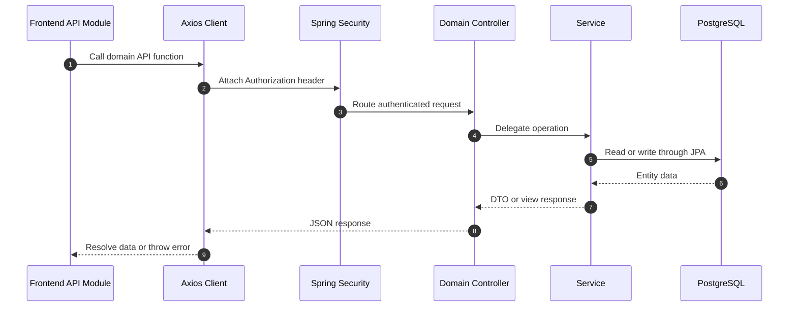

# API Guide

This document explains how the LifeOS backend API is organized and how to use the generated Swagger/OpenAPI documentation. It intentionally does not duplicate every request and response schema by hand because the running backend already generates that catalog through SpringDoc.

## Swagger and OpenAPI

When the backend is running locally, use:

- Swagger UI: `http://localhost:8080/swagger-ui/index.html`
- OpenAPI JSON: `http://localhost:8080/v3/api-docs`

Swagger is the source of truth for exact request bodies, response schemas, and endpoint metadata.

## Authentication Requirements

Most API routes require a JWT:

```http
Authorization: Bearer <jwt>
```

Public routes include authentication, OAuth exchange, Swagger/OpenAPI, and the WebSocket endpoint. All other backend routes are protected by Spring Security.

See [Authentication](authentication.md) for the full security lifecycle.

## API Organization

The backend uses domain-oriented controllers rather than a single global API controller. The route groups below are based on controller mappings in the implementation.

| Domain | Base Route | Controller | Authentication |
| --- | --- | --- | --- |
| Credentials auth | `/api/auth` | `AuthController` | Public |
| OAuth exchange | `/api/auth/oauth` | `OAuthExchangeController` | Public |
| Tasks | `/api/task` | `TaskController` | JWT |
| Prioritized tasks | `/api/tasks` | `PrioritizationController` | JWT |
| Labels | `/api/labels` | `LabelController` | JWT |
| Notes | `/api/notes` | `NoteController` | JWT |
| Student profile | `/api/profile` | `StudentController` | JWT |
| Branches | `/api/branch` | `BranchController` | JWT |
| Dashboard | `/api/dashboard` | `DashboardController` | JWT |
| Activity | `/api/activities` | `ActivityController` | JWT |
| Insights | `/api/insights` | `InsightsController` | JWT |
| Stats | `/api/stats` | `StatsController` | JWT |
| Levels | `/api/levels` | `LevelController` | JWT |
| Friends | `/api/friends` | `FriendController` | JWT |
| Social feed | `/api/social` | `FriendFeedController` | JWT |
| Leaderboard | `/api/leaderboard` | `LeaderboardController` | JWT |
| Notifications | `/api/notifications` | `NotificationController` | JWT |
| AI task generation | `/api/task-generation` | `TaskGenerationController` | JWT |
| User account | `/users` | `UserController` | JWT |

## Module Notes

### Authentication

Credentials registration and login return the same JWT session format used by the rest of the application. Google OAuth uses a temporary exchange code and then returns an application JWT from `/api/auth/oauth/exchange`.

### Tasks, Labels, and Notes

Task routes cover CRUD, filtering, status changes, upcoming tasks, and task stats. Labels are user-owned and carry priority weights. Notes can exist independently or link to a task.

### Prioritization

Prioritized task routes return calculated priority information. The score is produced by backend logic using due dates, status, manual priority, and label weight.

### Profile and Social

Profile routes manage student-specific metadata. Friend routes manage request and relationship lifecycles. Social feed and leaderboard routes read from profile, friendship, activity, and stats data.

### Dashboard and Insights

Dashboard routes aggregate data for the main workspace. Insights routes provide trend, heatmap, timeline, and distribution data used by activity views.

### Notifications

Notification REST endpoints support persisted notification lists, unread counts, and read-state changes. Real-time delivery uses STOMP WebSockets and is documented in [WebSockets](websocket.md).

### AI Task Generation

The task-generation route delegates prompt construction and model access to the `taskgeneration` package. The Gemini API key and model are configured through environment variables.

## Request Lifecycle



## Error Handling

The backend includes a centralized `GlobalExceptionHandler` and custom exceptions for invalid requests, not-found resources, duplicate resources, conflicts, invalid JWTs, and expired JWTs. Exact response bodies should be checked in Swagger and the exception handler implementation.

## Using the API Locally

1. Start the backend with required environment variables.
2. Open Swagger UI at `http://localhost:8080/swagger-ui/index.html`.
3. Register or log in through the auth endpoints.
4. Use the returned JWT as a Bearer token for protected routes.

Example header:

```http
Authorization: Bearer eyJhbGciOi...
```

## Related Documentation

- [Authentication](authentication.md)
- [Backend Guide](backend.md)
- [Frontend Guide](frontend.md)
- [WebSockets](websocket.md)
- [Database](database.md)

## Conclusion

LifeOS APIs are organized around product domains and documented at runtime through SpringDoc OpenAPI. Keep Swagger as the exact endpoint reference and use this guide for orientation, authentication expectations, and module-level understanding.
