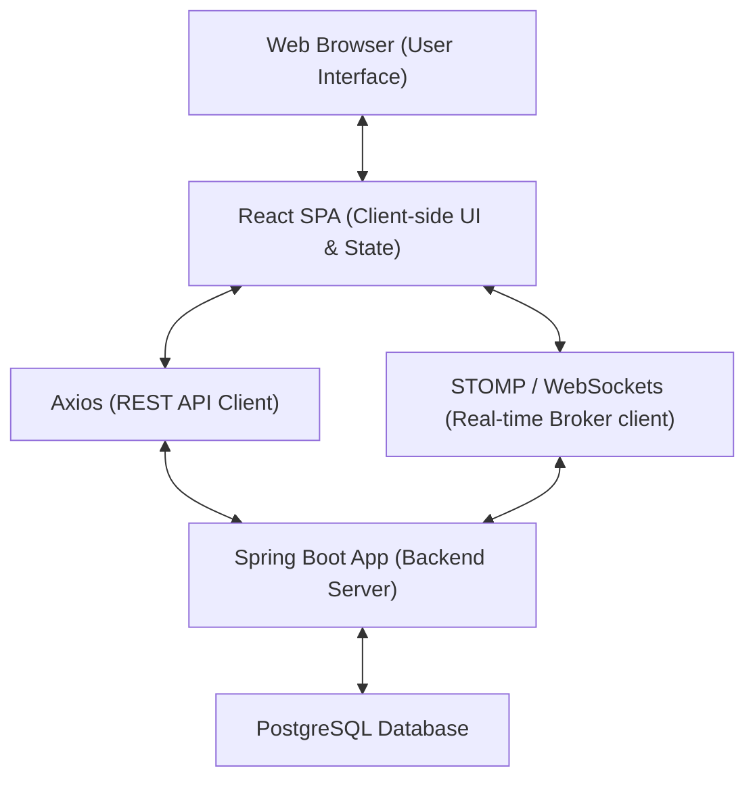
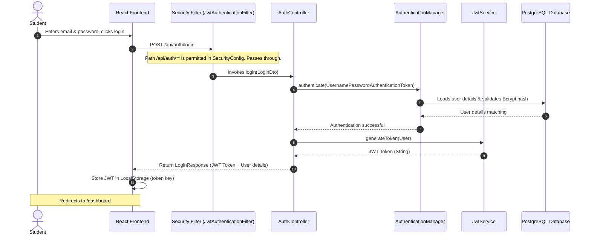
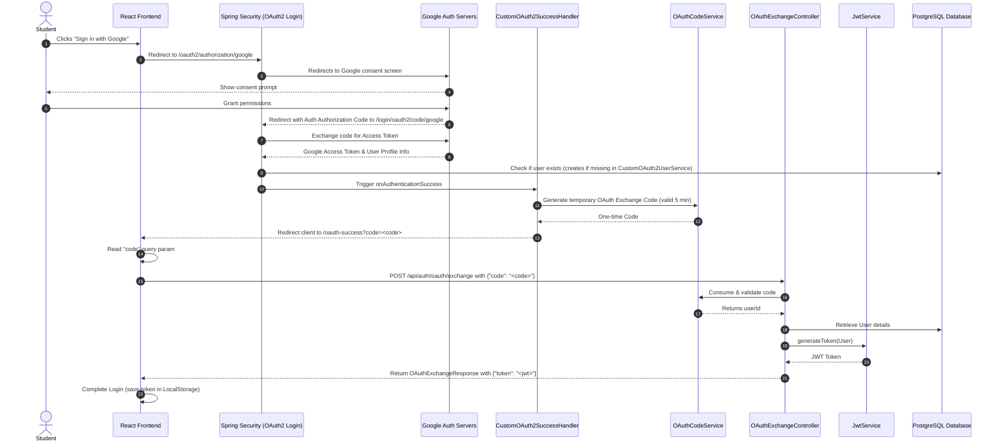
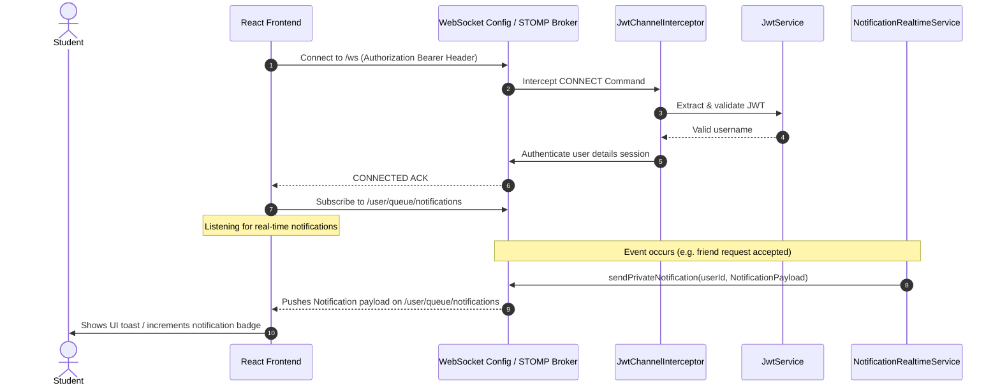
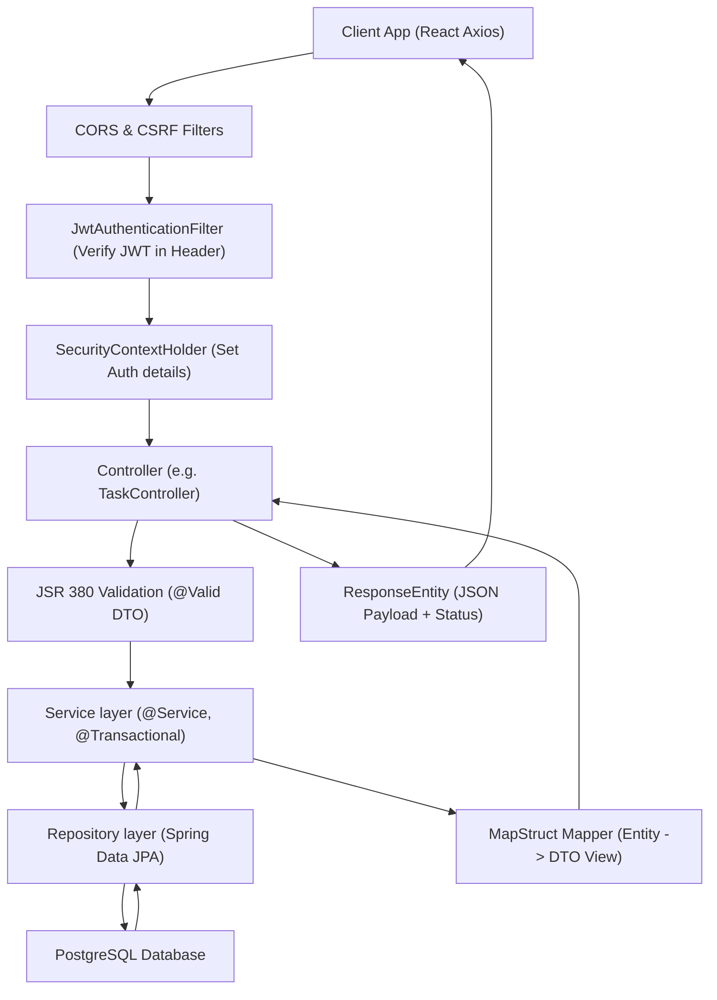

# LifeOS System Architecture

This document describes the high-level architecture, communication protocols, authentication lifecycles, and request execution paths for the LifeOS application.

---

## High-Level Architecture

LifeOS uses a decoupled client-server architecture:
- **Frontend SPA**: A single-page application built with React, Vite, and Tailwind CSS.
- **Backend Service**: A modular monolith built with Java 21, Spring Boot, and Spring Security.
- **Database**: A PostgreSQL database for persistent relational storage.
- **Real-time Engine**: Native WebSockets running the STOMP message protocol.

---

## Authentication Lifecycle (JWT)

LifeOS uses stateless JWT-based authorization. When users register or log in with credentials, they receive a JWT that must be sent in the `Authorization` header of subsequent API calls.

---

## Google OAuth2 Exchange Flow

LifeOS implements social authentication using Google Sign-In, integrated into the Spring Security OAuth2 login filter chain. Rather than sending credentials directly to the frontend, a secure redirection-exchange protocol is implemented.

---

## WebSocket Notification Lifecycle

Real-time capabilities (like instant friend alerts or milestone notifications) run over STOMP WebSockets. A custom Spring Message `ChannelInterceptor` extracts the JWT to authorize connection handshakes before subscription.

---

## Request Lifecycle (Spring Boot)

Every API request targeting a protected route passes through a structured execution pipeline:

1. **CORS & Security Configurations**: Validates request headers and checks allowed origins.
2. **JwtAuthenticationFilter**: If an `Authorization` header is present with a `Bearer ` token, it extracts and validates the token. If valid, the security context is updated.
3. **Security Context Guard**: Matches the request URI against the filter chain configuration. If the path requires authentication, it asserts that the authentication token is present in the session context.
4. **Controller Handling**: Routes requests to the designated mapping methods, executing JSR-380 binding validations (`@Valid`) on incoming bodies.
5. **Business Services**: Controllers delegate logic to services, running within transactional boundaries (`@Transactional`).
6. **Persistence Repositories**: Services execute DB actions using Spring Data JPA.
7. **Mapping Layer**: Maps internal Database Entities to clean View DTOs using MapStruct converters.
8. **REST Response**: The controller returns a `ResponseEntity` serializing the DTO as a JSON body back to the client.
