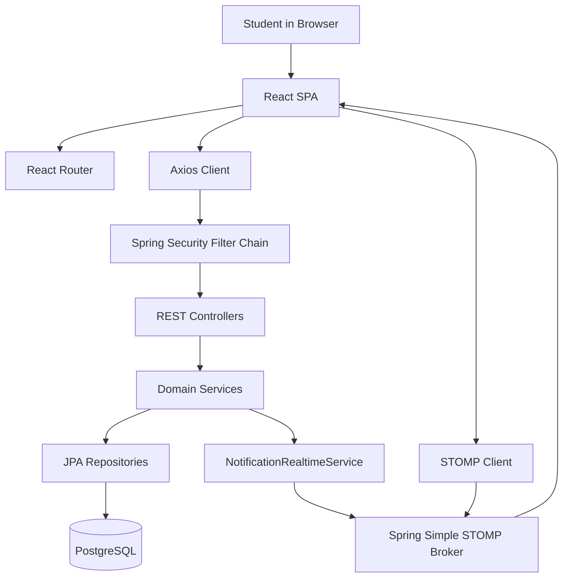
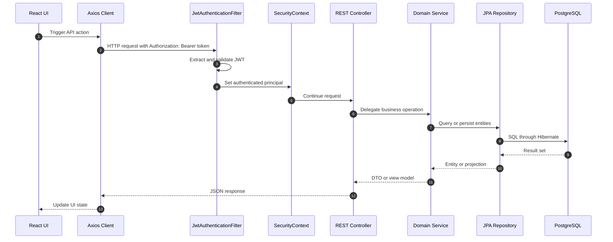
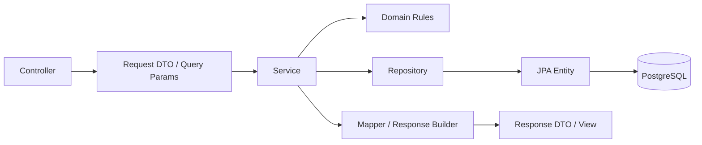
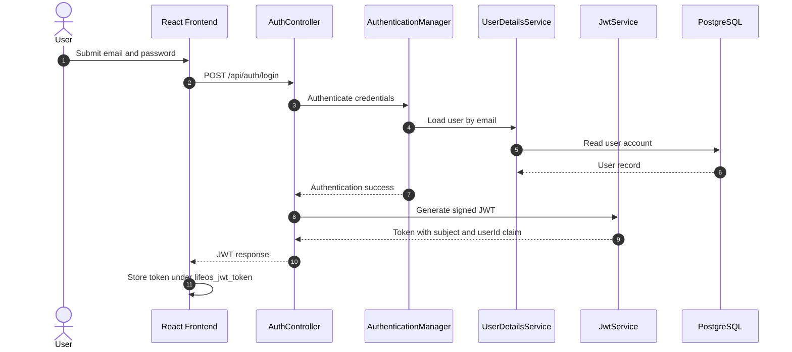
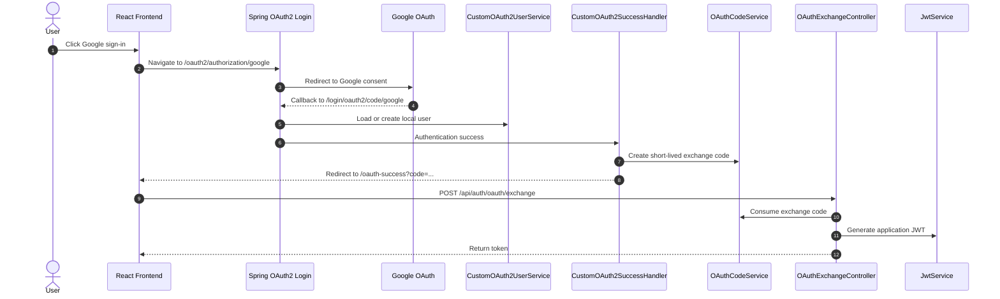
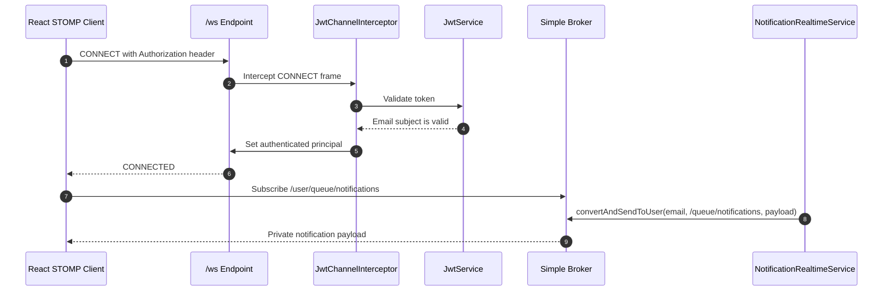
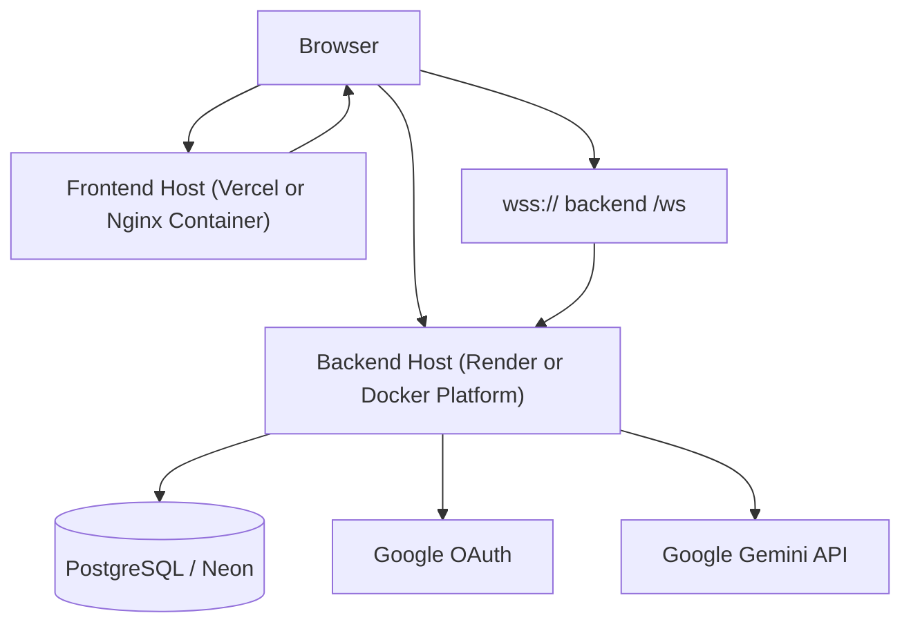

# System Architecture

This document explains how LifeOS is assembled at a system level: the browser client, REST API, WebSocket broker, security flow, business modules, and PostgreSQL database.

## Overview

LifeOS uses a decoupled client-server architecture. The frontend is a React single-page application built with Vite. The backend is a Spring Boot modular monolith that exposes REST APIs, handles authentication, runs domain services, publishes WebSocket notifications, and persists data through Spring Data JPA.

## Core Components

| Component | Implementation | Responsibility |
| --- | --- | --- |
| Frontend SPA | `frontend/src` | Pages, protected routing, dashboard, task workspace, profile, social, notifications, and API clients. |
| REST API | `backend/src/main/java/users/java/LifeOS` | Domain endpoints for auth, tasks, labels, notes, profile, friends, stats, insights, dashboard, and notifications. |
| Security | `auth.config`, `auth.filters`, `auth.oauth` | JWT validation, stateless Spring Security, credentials login, and Google OAuth exchange. |
| WebSockets | `websocket` | STOMP endpoint `/ws`, JWT-authenticated `CONNECT`, and private notification queues. |
| Persistence | JPA entities and repositories | PostgreSQL-backed data model for users, profiles, tasks, labels, notes, activity, friends, stats, and notifications. |
| AI integration | `taskgeneration` | Google Gemini-backed task draft generation. |

## Request Lifecycle

Protected HTTP requests use the same bearer token model across domains.

## Backend Component Interaction

The backend follows a package-by-domain structure. Within each domain, controllers delegate to services, services coordinate repositories and domain helpers, and mappers shape entities into DTOs or views.

## JWT Authentication Flow

Credentials-based login creates the same JWT session format that OAuth exchange eventually produces.

## Google OAuth Flow

LifeOS uses Spring Security OAuth2 login with a custom success handler. The success handler redirects the frontend with a temporary exchange code instead of putting the final JWT in the redirect URL.

## WebSocket Communication

WebSocket notifications reuse JWT identity during the STOMP `CONNECT` frame. The backend binds the authenticated principal to the session and sends private notifications through `/user/queue/notifications`.

## Deployment Architecture

The repository supports independent frontend, backend, and database deployment. Current files support Vercel-style SPA rewrites for the frontend, Docker image builds for both apps, and PostgreSQL through environment variables.

## Architectural Boundaries

- The frontend owns client-side routing, presentation state, route guards, API orchestration, and user-facing workflows.
- The backend owns authentication, authorization, persistence, business rules, score calculation, notification creation, and data aggregation.
- PostgreSQL owns durable relational state.
- Swagger/OpenAPI is generated from the running backend rather than hand-maintained as duplicated endpoint documentation.

## Related Documentation

- [Backend Guide](backend.md)
- [Frontend Guide](frontend.md)
- [Authentication](authentication.md)
- [WebSockets](websocket.md)
- [Database](database.md)
- [Engineering Decisions](engineering-decisions.md)

## Conclusion

LifeOS is intentionally structured as a deployable full-stack system rather than a single-process prototype. Its strongest architectural throughline is separation of concerns: a browser-based SPA, a domain-oriented Spring Boot API, stateless identity, real-time notifications, and PostgreSQL persistence.
