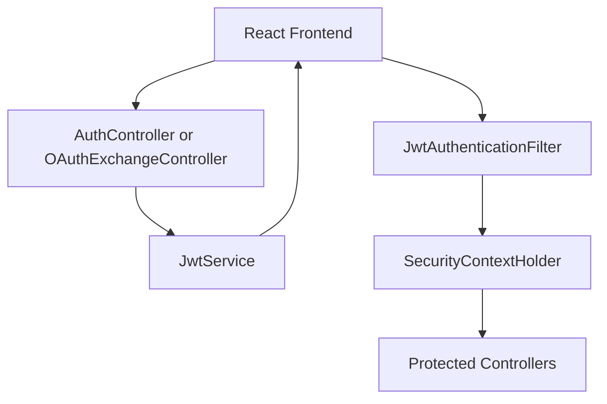
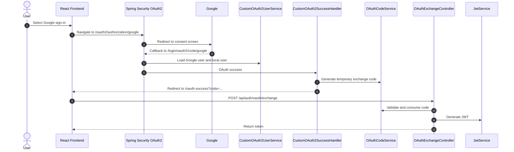

# Authentication

This document explains LifeOS authentication and authorization: JWT lifecycle, Spring Security configuration, Google OAuth sign-in, CORS, and WebSocket identity reuse.

## Overview

LifeOS uses stateless authentication. After successful credentials login, registration, or Google OAuth exchange, the backend issues a signed JWT. The frontend stores that token and sends it with protected REST requests and WebSocket connection attempts.



## JWT Lifecycle

`auth.services.JwtService` creates and validates JWTs using JJWT.

| Property | Implementation |
| --- | --- |
| Signing algorithm | HMAC SHA-256 through `Jwts.SIG.HS256`. |
| Subject | User email. |
| Custom claim | `userId`. |
| Secret | `JWT_SECRET`. |
| Expiration | `JWT_EXPIRATION`, defaulting to `60000000` milliseconds. |

### Credentials Login

```mermaid
sequenceDiagram
    autonumber
    actor User
    participant FE as React Frontend
    participant Auth as AuthController
    participant Manager as AuthenticationManager
    participant Details as UserDetailsService
    participant JWT as JwtService
    participant DB as PostgreSQL

    User->>FE: Enter email and password
    FE->>Auth: POST /api/auth/login
    Auth->>Manager: Authenticate credentials
    Manager->>Details: Load user by email
    Details->>DB: Query users table
    DB-->>Details: User credentials
    Manager-->>Auth: Authentication successful
    Auth->>JWT: Generate token
    Auth-->>FE: Return token
    FE->>FE: Store token in local storage
```

### Request Authorization

For protected requests, `JwtAuthenticationFilter` checks the `Authorization` header:

```http
Authorization: Bearer <jwt>
```

If the token is valid and not expired, the filter creates an authenticated principal and stores it in the `SecurityContextHolder`.

## Spring Security Configuration

`auth.config.SecurityConfig` configures:

- Stateless sessions with `SessionCreationPolicy.STATELESS`.
- Disabled form login and HTTP basic auth.
- Disabled CSRF for bearer-token API usage.
- CORS through `CorsConfig`.
- A DAO authentication provider using `BCryptPasswordEncoder(12)`.
- OAuth2 login with custom authorization-request, user-service, success, and failure handlers.
- `JwtAuthenticationFilter` before `UsernamePasswordAuthenticationFilter`.

Public paths include:

- `/`
- `/api/auth/**`
- `/api/register`
- `/api/login`
- `/api/refreshToken`
- `/api/oauth2/**`
- `/api/login/oauth2/**`
- `/ws` and `/ws/**`
- `/swagger-ui/**`
- `/v3/api-docs/**`
- `/docs`

All other requests require authentication.

## CORS

`auth.config.CorsConfig` allows requests from the configured frontend origin:

```env
FRONTEND_URL=http://localhost:5173
```

Allowed HTTP methods are `GET`, `POST`, `PUT`, `PATCH`, `DELETE`, and `OPTIONS`. Credentials are allowed, and headers are open through `*`.

For production, `FRONTEND_URL` must exactly match the deployed frontend origin, including protocol.

## Google OAuth Flow

Google OAuth is implemented with Spring Security OAuth2 login and custom application session exchange.



The exchange-code design avoids placing the final application JWT directly in the browser redirect URL. The frontend receives a temporary code, posts it to the backend, and then stores the returned JWT under `lifeos_jwt_token`. In the current implementation, exchange codes are stored in a Caffeine cache for 2 minutes and are consumed once.

## WebSocket Authentication

WebSocket sessions authenticate through the STOMP `CONNECT` frame. `JwtChannelInterceptor` extracts the same Bearer token from the native STOMP headers, validates it through `JwtService`, and binds the authenticated principal to the WebSocket session.

See [WebSockets](websocket.md) for the full flow.

## Security Notes

- JWTs are stateless, so backend instances do not need server-side HTTP session storage for normal API authorization.
- Tokens expire based on `JWT_EXPIRATION`; no refresh-token lifecycle is currently documented in the implementation.
- The frontend stores the token in local storage.
- OAuth exchange codes are temporary and consumed by `/api/auth/oauth/exchange`.
- HTTPS is required in production to protect credentials, bearer tokens, OAuth callbacks, and `wss://` WebSocket traffic.

## Related Documentation

- [System Architecture](architecture.md)
- [API Guide](api.md)
- [WebSockets](websocket.md)
- [Database](database.md)
- [Deployment](deployment.md)

## Conclusion

LifeOS uses one application session model across login methods: credentials and Google OAuth both result in a signed JWT that protects REST APIs and authorizes WebSocket notification sessions.
