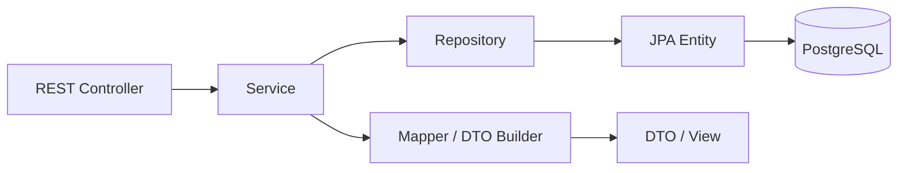

# Backend Guide

This guide explains the LifeOS backend implementation: package organization, request boundaries, persistence patterns, authentication integration, and the main domain modules.

## Backend Overview

The backend is a Java 21 Spring Boot application under `backend/`. It exposes REST APIs, handles Spring Security authentication, publishes STOMP WebSocket notifications, runs scheduled/statistical services, integrates with Google OAuth and Gemini, and persists data in PostgreSQL through Spring Data JPA.

The main package is:

```text
users.java.LifeOS
```

## Package Organization

LifeOS uses a package-by-domain structure. Related controllers, services, repositories, DTOs, mappers, and entities live close to the domain they support.

| Package | Responsibility |
| --- | --- |
| `auth` | Security configuration, JWT service, credentials auth, OAuth handlers, user principal, and filters. |
| `user` | Core user account model and account APIs. |
| `student` | Student profile creation, updates, public profile views, and discovery search. |
| `branch` | Academic branch metadata and branch seeding. |
| `task` | Task CRUD, filtering, status updates, task views, and task statistics. |
| `task.label` | User-owned labels, default labels, colors, and priority weights. |
| `task.prioritization` | Task scoring, priority levels, explanation generation, and prioritized task responses. |
| `taskgeneration` | AI-assisted task generation request handling and Gemini integration. |
| `note` | Study notes and optional task-linked notes. |
| `activity` | Activity records, points metadata, and timeline-style activity responses. |
| `stats` | User stats, rebuild/update services, points counters, and scheduled recalculation. |
| `stats.streak` | Streak tracking, milestone services, and scheduled streak updates. |
| `level` | Level and progression calculations. |
| `rewards` | Reward actions and point calculation. |
| `friend` | Friendships, relationship status, and friend list operations. |
| `friend.request` | Incoming/outgoing friend request lifecycle and validation rules. |
| `feed` | Friend activity feed aggregation. |
| `leaderboard` | Global, friends, and college leaderboard scopes. |
| `dashboard` | Aggregated dashboard response for the authenticated user. |
| `insights` | Productivity summaries, heatmap data, weekly trends, and focus distribution. |
| `notification` | Notification storage, unread/read APIs, scheduled notifications, and response mapping. |
| `websocket` | STOMP endpoint configuration, JWT channel interception, and real-time notification dispatch. |
| `exceptions` | Centralized exception types and API error handling. |
| `demo` | Optional demo data generation controlled by environment variables. |
| `util` | Shared base entity timestamp support. |

## Layering Pattern

Most backend domains follow this structure:



| Layer | Role |
| --- | --- |
| Controller | Defines HTTP routes, validates input, and delegates business work. |
| Service | Enforces domain rules, owns transactions, and coordinates repositories/helpers. |
| Repository | Uses Spring Data JPA for persistence queries. |
| Entity | Maps the database model with Jakarta Persistence annotations. |
| DTO/View | Shapes request and response payloads for the frontend. |
| Mapper | Converts entities into client-safe response models. MapStruct is used where mapper interfaces are present. |

## Core Backend Systems

### Authentication and Authorization

`SecurityConfig` defines a stateless Spring Security chain. Public routes include `/api/auth/**`, OAuth endpoints, `/ws`, Swagger UI, and OpenAPI docs. Other routes require authentication.

`JwtAuthenticationFilter` extracts Bearer tokens from HTTP requests and asks `JwtService` to parse, validate, and map them to a Spring Security principal.

See [Authentication](authentication.md) for the complete lifecycle.

### Task and Prioritization Domain

Task management is centered on `Task`, `TaskService`, `TaskController`, and supporting DTO/view classes. Smart prioritization is separated into `task.prioritization`, where `TaskPriorityCalculator` scores tasks using:

- Due date proximity and overdue state.
- Current task status.
- Manual priority.
- Label priority weight.

The calculator returns a score, a `SmartPriorityLevel`, and human-readable reasons.

### Profile, Social, and Accountability

Student profiles extend user accounts with academic metadata. Friend requests and friendships are modeled separately so the system can represent pending requests independently from accepted relationships. Leaderboards and social feeds build on stats, friend relationships, and activity data.

### Dashboard and Insights

The dashboard service aggregates several backend domains into a single response for the main workspace. Insights services expose trend, timeline, heatmap, and focus-distribution data used by the activity UI.

### Notifications and WebSockets

Notifications are persisted in the `notifications` table and can also be pushed to online users through `NotificationRealtimeService`. WebSocket authentication is handled during the STOMP `CONNECT` frame by `JwtChannelInterceptor`.

See [WebSockets](websocket.md).

### AI-Assisted Task Generation

The `taskgeneration` package contains the request controller, prompt-building logic, an AI client interface, and a Gemini-backed implementation. The Gemini model and API key are supplied through environment variables.

## Configuration

Backend configuration is stored in `backend/src/main/resources/application.properties` and reads environment variables for database, JWT, OAuth, Gemini, frontend origin, and demo-data settings.

| Area | Variables |
| --- | --- |
| Database | `DB_URL`, `DB_USERNAME`, `DB_PASSWORD`, `DDL_AUTO`, `SHOW_SQL` |
| Security | `JWT_SECRET`, `JWT_EXPIRATION` |
| Google OAuth | `GOOGLE_CLIENT_ID`, `GOOGLE_CLIENT_SECRET` |
| Gemini | `GEMINI_API_KEY`, `GEMINI_MODEL` |
| Frontend/CORS | `FRONTEND_URL` |
| Demo data | `DEMO_ENABLED`, `DEMO_USERS`, `TASKS_PER_USER`, `MAX_FRIENDS`, `RANDOM_SEED` |

## Testing

Backend tests live under `backend/src/test/java`. Run them with:

```bash
cd backend
./mvnw test
```

On Windows:

```powershell
cd backend
.\mvnw.cmd test
```

## Related Documentation

- [System Architecture](architecture.md)
- [API Guide](api.md)
- [Authentication](authentication.md)
- [Database](database.md)
- [Engineering Decisions](engineering-decisions.md)

## Conclusion

The backend is organized as a modular monolith: one deployable Spring Boot service, but with clear domain boundaries. That keeps local development and deployment simple while preserving enough structure for future maintainers to reason about each feature area independently.
