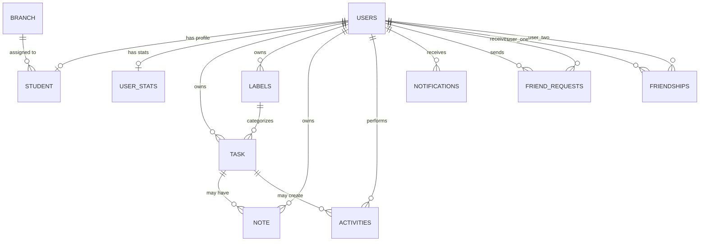

# Database

This document describes the LifeOS persistence model: PostgreSQL usage, JPA entities, key relationships, and operational database considerations.

## Overview

LifeOS uses PostgreSQL as its relational database. The backend maps data through Jakarta Persistence entities and Spring Data JPA repositories. Hibernate is configured with the PostgreSQL dialect and reads connection details from environment variables.

```properties
spring.datasource.url=${DB_URL}
spring.datasource.username=${DB_USERNAME}
spring.datasource.password=${DB_PASSWORD}
spring.jpa.database-platform=org.hibernate.dialect.PostgreSQLDialect
spring.jpa.hibernate.ddl-auto=${DDL_AUTO:update}
```

## Entity Relationship Diagram



## Main Tables

| Entity | Table | Purpose |
| --- | --- | --- |
| `User` | `users` | Authentication identity, email, password hash for local users, role, provider, and provider ID. |
| `Student` | `student` | Student profile attached one-to-one to a user, including name, age, college, year, branch, and bio. |
| `Branch` | `branch` | Academic branch metadata, seeded at startup. |
| `Task` | `task` | User-owned tasks with title, description, status, type, due date, completion date, awarded points, manual priority, and optional label. |
| `Label` | `labels` | User-owned focus labels with name, color, and priority weight. |
| `Note` | `note` | User-owned notes with title, message, and optional task link. |
| `Activity` | `activities` | User activity events with type, title, description, points, and optional task link. |
| `UserStats` | `user_stats` | Aggregated counters for points, streaks, task counts, active days, and friend count. |
| `FriendRequest` | `friend_requests` | Pending or resolved friend request records between users. |
| `Friendship` | `friendships` | Accepted friend relationship pairs with a unique user-pair constraint. |
| `Notification` | `notifications` | Persisted user notifications, read state, schedule metadata, and JSONB metadata. |

## Relationship Notes

### User-Centered Model

Most entities are owned by `User`, which keeps authorization checks anchored to the authenticated principal. Profiles and stats are one-to-one with users; tasks, labels, notes, activities, notifications, friend requests, and friendships are user-linked.

### Student Profiles and Branches

`Student` links to `User` with a unique `user_id`, creating one profile per account. It also optionally links to `Branch`. When a branch is deleted, the student branch reference is set to null.

### Tasks, Labels, and Notes

Tasks belong to users and may reference a label. Labels also belong to users. When a label is deleted, task label references are set to null. Notes belong to users and may optionally reference a task.

### Social Relationships

Friend requests store sender, receiver, status, creation time, and resolution time. Accepted friendships are represented separately in `friendships`, with `user_one_id` and `user_two_id` constrained as a unique pair.

### Notifications

Notifications belong to users and include a JSONB `metadata` column for event-specific details. Notification persistence is separate from WebSocket delivery, so users can still retrieve notification history after reconnecting.

## Auditing Fields

Several entities extend `BaseEntity`, which provides:

- `createdAt`
- `updatedAt`

These timestamps are populated by JPA lifecycle callbacks with `@PrePersist` and `@PreUpdate`.

Entities that extend `BaseEntity` include users, students, tasks, labels, notes, and activities.

## Schema Management

The current configuration uses Hibernate `ddl-auto` with this default:

```env
DDL_AUTO=update
```

That is convenient during development. For production, use a more controlled strategy:

```env
DDL_AUTO=validate
```

or introduce a migration tool such as Flyway or Liquibase before the schema needs coordinated releases.

## Deployment Notes

Managed PostgreSQL providers such as Neon can be used as long as `DB_URL`, `DB_USERNAME`, and `DB_PASSWORD` are configured for the backend. If the provider requires SSL, include the provider's required SSL parameters in the JDBC URL.

## Related Documentation

- [Backend Guide](backend.md)
- [Authentication](authentication.md)
- [API Guide](api.md)
- [Deployment](deployment.md)
- [Engineering Decisions](engineering-decisions.md)

## Conclusion

The database model is intentionally relational and user-centered. That supports clear ownership checks, social relationships, aggregated stats, and task/note workflows while keeping the persistence layer understandable through JPA entities.
