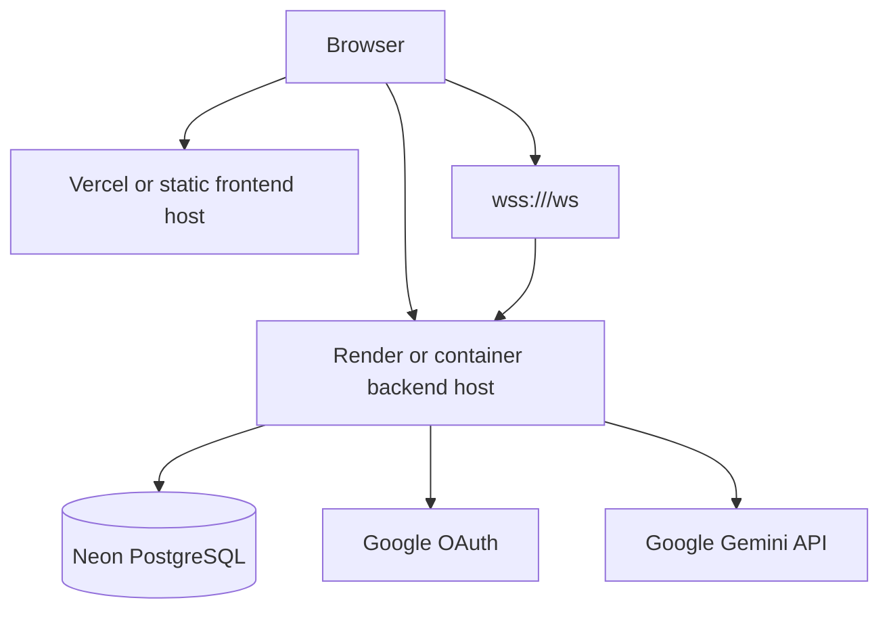

# Deployment

This guide explains how to deploy LifeOS using the deployment targets supported by the repository structure: a containerized Spring Boot backend, a Vite React frontend, and a managed PostgreSQL database.

## Deployment Overview

A production deployment has three primary pieces:



## Recommended Hosting Split

| Layer | Suggested Provider | Repository Support |
| --- | --- | --- |
| Frontend | Vercel | `frontend/vercel.json` rewrites all routes to `index.html`. |
| Backend | Render | `backend/Dockerfile` builds the Spring Boot API container. |
| Database | Neon PostgreSQL | Backend reads a JDBC URL through `DB_URL`. |

Other providers can work as long as they support the same requirements: static frontend hosting, Java/container backend hosting, PostgreSQL, HTTPS, and environment variables.

## Neon PostgreSQL

1. Create a Neon project and PostgreSQL database.
2. Copy the JDBC connection string.
3. Configure backend variables:

```env
DB_URL=jdbc:postgresql://<host>/<database>?sslmode=require
DB_USERNAME=<username>
DB_PASSWORD=<password>
```

Production note: `application.properties` defaults `DDL_AUTO` to `update`. For stricter production control, set:

```env
DDL_AUTO=validate
SHOW_SQL=false
```

Only use `validate` after the schema already matches the JPA model.

## Render Backend Deployment

Use the backend Dockerfile as the deployable unit.

### Render Setup

1. Create a new Render web service.
2. Select Docker as the runtime.
3. Set the Docker build context to `backend` if Render asks for the root of the service.
4. Expose port `8080`.
5. Add backend environment variables in Render's dashboard.

### Required Backend Variables

| Variable | Required | Description |
| --- | --- | --- |
| `DB_URL` | Yes | JDBC PostgreSQL URL. |
| `DB_USERNAME` | Yes | Database user. |
| `DB_PASSWORD` | Yes | Database password. |
| `JWT_SECRET` | Yes | HMAC signing secret. Use a long random value. |
| `GOOGLE_CLIENT_ID` | Yes for Google login | Google OAuth client ID. |
| `GOOGLE_CLIENT_SECRET` | Yes for Google login | Google OAuth client secret. |
| `GEMINI_API_KEY` | Yes for AI task generation | Gemini API key. |
| `FRONTEND_URL` | Yes in production | Exact frontend origin, such as `https://lifeos.example.com`. |

### Optional Backend Variables

| Variable | Default | Notes |
| --- | --- | --- |
| `JWT_EXPIRATION` | `60000000` | Token lifetime in milliseconds. |
| `GEMINI_MODEL` | `gemini-2.5-flash` | Gemini model name. |
| `DDL_AUTO` | `update` | Prefer `validate` or a migration tool for mature production deployments. |
| `SHOW_SQL` | `true` | Set `false` in production. |
| `DEMO_ENABLED` | `false` | Enables startup demo data generation. Keep disabled for real production data. |
| `DEMO_USERS` | `40` | Demo data setting. |
| `TASKS_PER_USER` | `25` | Demo data setting. |
| `MAX_FRIENDS` | `8` | Demo data setting. |
| `RANDOM_SEED` | `42` | Demo data setting. |

## Vercel Frontend Deployment

The frontend is a Vite app in `frontend/`.

### Vercel Setup

1. Create a Vercel project for the repository.
2. Set the root directory to `frontend`.
3. Use the default Vite build command:

```bash
npm run build
```

4. Use the output directory:

```text
dist
```

5. Add the required frontend environment variable:

```env
VITE_API_URL=https://<backend-domain>
```

`frontend/vercel.json` rewrites all routes to `index.html`, which allows direct navigation to React Router routes such as `/dashboard`.

## Google OAuth Configuration

In Google Cloud Console, create an OAuth 2.0 Web Application client.

Authorized JavaScript origins:

```text
https://<frontend-domain>
http://localhost:5173
```

Authorized redirect URIs:

```text
https://<backend-domain>/login/oauth2/code/google
http://localhost:8080/login/oauth2/code/google
```

The production redirect URI must point to the backend because Spring Security handles the OAuth callback.

## Build Process

### Backend

Render or Docker builds:

```bash
cd backend
mvn clean package -DskipTests
java -jar target/lifeos-backend.jar
```

The Dockerfile performs these steps inside the container build.

### Frontend

Vercel or Docker builds:

```bash
cd frontend
npm install
npm run build
```

`VITE_API_URL` must be set before this build runs.

## Deployment Workflow

1. Provision PostgreSQL and collect database credentials.
2. Deploy backend with Docker and configure environment variables.
3. Confirm Swagger UI loads at the backend domain.
4. Configure Google OAuth redirect URIs using the backend domain.
5. Deploy frontend with `VITE_API_URL` pointing to the backend domain.
6. Set `FRONTEND_URL` in the backend to the frontend domain.
7. Test credentials login, Google OAuth, protected API calls, and WebSocket notifications.

## Common Issues and Troubleshooting

| Issue | Symptom | Fix |
| --- | --- | --- |
| CORS mismatch | Browser blocks API calls from the frontend. | Set `FRONTEND_URL` to the exact frontend origin, including `https://`. |
| Wrong frontend API URL | Frontend calls localhost or an old backend after deployment. | Set `VITE_API_URL` in the frontend host and rebuild. |
| OAuth redirect mismatch | Google returns `redirect_uri_mismatch`. | Add `https://<backend-domain>/login/oauth2/code/google` to Google OAuth redirect URIs. |
| WebSocket blocked | Notifications do not connect in production. | Use HTTPS backend URL so the frontend derives `wss://`; ensure proxy upgrade headers are supported. |
| Database SSL issue | Backend cannot connect to Neon. | Include provider-required SSL settings in `DB_URL`, such as `sslmode=require`. |
| Schema mismatch | Backend starts but JPA validation fails. | Apply schema updates or temporarily use `DDL_AUTO=update` in non-production environments. |
| Gemini failure | AI task generation fails. | Confirm `GEMINI_API_KEY` and `GEMINI_MODEL` are configured. |

## Production Hardening

- Use managed secrets in Render/Vercel instead of committed environment files.
- Disable verbose SQL logging with `SHOW_SQL=false`.
- Add database migrations before using strict schema validation in a long-running production environment.
- Add CI for backend tests and frontend builds.
- Add monitoring/log aggregation if this becomes a live multi-user service.
- Review token storage and session strategy as the security threat model grows.

## Related Documentation

- [Docker](docker.md)
- [Authentication](authentication.md)
- [WebSockets](websocket.md)
- [Database](database.md)
- [Engineering Decisions](engineering-decisions.md)

## Conclusion

LifeOS is designed to deploy as separate frontend and backend services backed by managed PostgreSQL. The most important deployment details are build-time `VITE_API_URL`, runtime `FRONTEND_URL`, correct OAuth redirects, and HTTPS support for both REST and WebSocket traffic.
