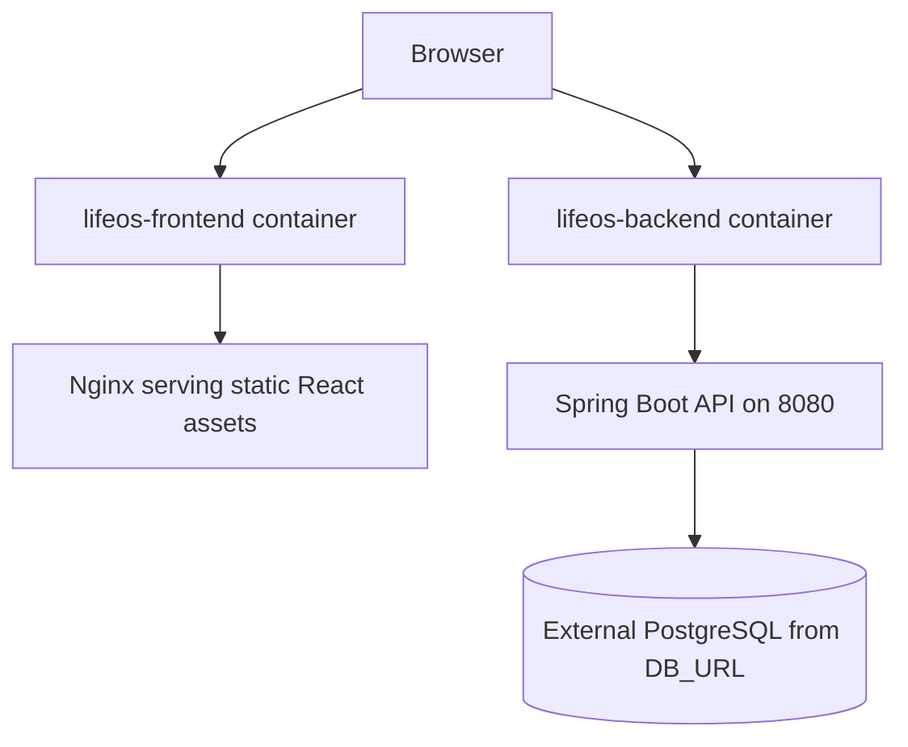

# Docker

This document explains the Docker setup for LifeOS: backend and frontend Dockerfiles, Docker Compose, container networking, local development, and production considerations.

## Overview

The repository includes two application images:

- `backend/Dockerfile`: builds and runs the Spring Boot API.
- `frontend/Dockerfile`: builds the Vite app and serves static assets with Nginx.

The root `docker-compose.yml` runs both services for local containerized development.



## Backend Dockerfile

`backend/Dockerfile` is a multi-stage build.

| Stage | Base Image | Purpose |
| --- | --- | --- |
| `builder` | `maven:3.9.11-eclipse-temurin-21` | Downloads Maven dependencies and packages the application JAR. |
| runtime | `eclipse-temurin:21-jre` | Runs the compiled `lifeos-backend.jar` with Java 21. |

Build behavior:

1. Copy `pom.xml`.
2. Run `mvn dependency:go-offline` for dependency layer caching.
3. Copy `src`.
4. Run `mvn clean package -DskipTests`.
5. Copy `/app/target/lifeos-backend.jar` into the runtime image as `app.jar`.
6. Expose port `8080`.

## Frontend Dockerfile

`frontend/Dockerfile` is also a multi-stage build.

| Stage | Base Image | Purpose |
| --- | --- | --- |
| `builder` | `node:22-alpine` | Installs npm dependencies and runs the Vite production build. |
| runtime | `nginx:alpine` | Serves compiled static files from `/usr/share/nginx/html`. |

The build accepts:

```text
ARG VITE_API_URL
```

That value is embedded into the compiled frontend bundle during `npm run build`.

## Nginx SPA Fallback

`frontend/nginx.conf` serves the React app and falls back to `index.html` for client-side routes:

```nginx
location / {
    try_files $uri $uri/ /index.html;
}
```

This is required because routes such as `/dashboard` and `/tasks/1` are handled by React Router, not by static files on disk.

## Docker Compose

The root `docker-compose.yml` defines:

| Service | Container | Host Port | Container Port | Notes |
| --- | --- | --- | --- | --- |
| `backend` | `lifeos-backend` | `8080` | `8080` | Loads variables from root `.env`. |
| `frontend` | `lifeos-frontend` | `5173` | `80` | Builds with `VITE_API_URL=http://localhost:8080`. |

Run locally:

```bash
docker compose build
docker compose up -d
```

Stop services:

```bash
docker compose down
```

## Required Environment File

Compose expects backend variables in a root `.env` file:

```env
DB_URL=jdbc:postgresql://<host>:<port>/<database>
DB_USERNAME=<username>
DB_PASSWORD=<password>
JWT_SECRET=<long-random-secret>
GOOGLE_CLIENT_ID=<google-client-id>
GOOGLE_CLIENT_SECRET=<google-client-secret>
GEMINI_API_KEY=<gemini-api-key>
FRONTEND_URL=http://localhost:5173
```

Optional values include `JWT_EXPIRATION`, `DDL_AUTO`, `SHOW_SQL`, `GEMINI_MODEL`, and demo-data settings.

## Container Networking

Docker Compose creates a default network where containers can resolve each other by service name. However, the React app runs in the user's browser after it is served by Nginx. Browser API calls do not originate inside Docker's internal network.

That is why the Compose frontend build uses:

```yaml
VITE_API_URL: http://localhost:8080
```

Using `http://backend:8080` would only work from inside another container, not from the browser on the host machine.

## Local Development Options

### Fully Containerized

Use Docker Compose for frontend and backend containers, while the backend connects to the PostgreSQL database configured by `DB_URL`.

### Hybrid Development

Run PostgreSQL and the backend locally, then run the frontend with Vite:

```bash
cd frontend
npm install
npm run dev
```

Hybrid mode is often faster for frontend iteration because Vite hot reload is available directly.

## Production Considerations

- Use production secrets from the hosting platform rather than committing `.env` files.
- Set `SHOW_SQL=false` in production.
- Prefer `DDL_AUTO=validate` or a migration tool once schema changes need stricter control.
- Set `VITE_API_URL` to the public backend URL before building the frontend image.
- Expose the backend through HTTPS so OAuth and WebSockets work reliably.
- If running multiple backend instances, review WebSocket scaling because the current implementation uses Spring's simple broker.

## Troubleshooting

| Problem | Likely Cause | Fix |
| --- | --- | --- |
| Frontend cannot reach backend | `VITE_API_URL` points to an internal Docker hostname or wrong port. | Rebuild frontend with the public browser-reachable backend URL. |
| Backend fails on startup | Missing database or secret variables. | Check `.env` and required backend variables. |
| Direct page refresh returns 404 | Static server does not fallback to `index.html`. | Use `frontend/nginx.conf` or equivalent host rewrites. |
| WebSocket fails in production | HTTPS page tries `ws://` or proxy blocks upgrades. | Use `https://` API URL and configure upgrade headers. |

## Related Documentation

- [Deployment](deployment.md)
- [System Architecture](architecture.md)
- [Frontend Guide](frontend.md)
- [Backend Guide](backend.md)

## Conclusion

Docker support keeps LifeOS portable: the backend ships as a Java runtime image, the frontend ships as static assets behind Nginx, and Compose provides a simple local orchestration path while still relying on explicit environment configuration.
