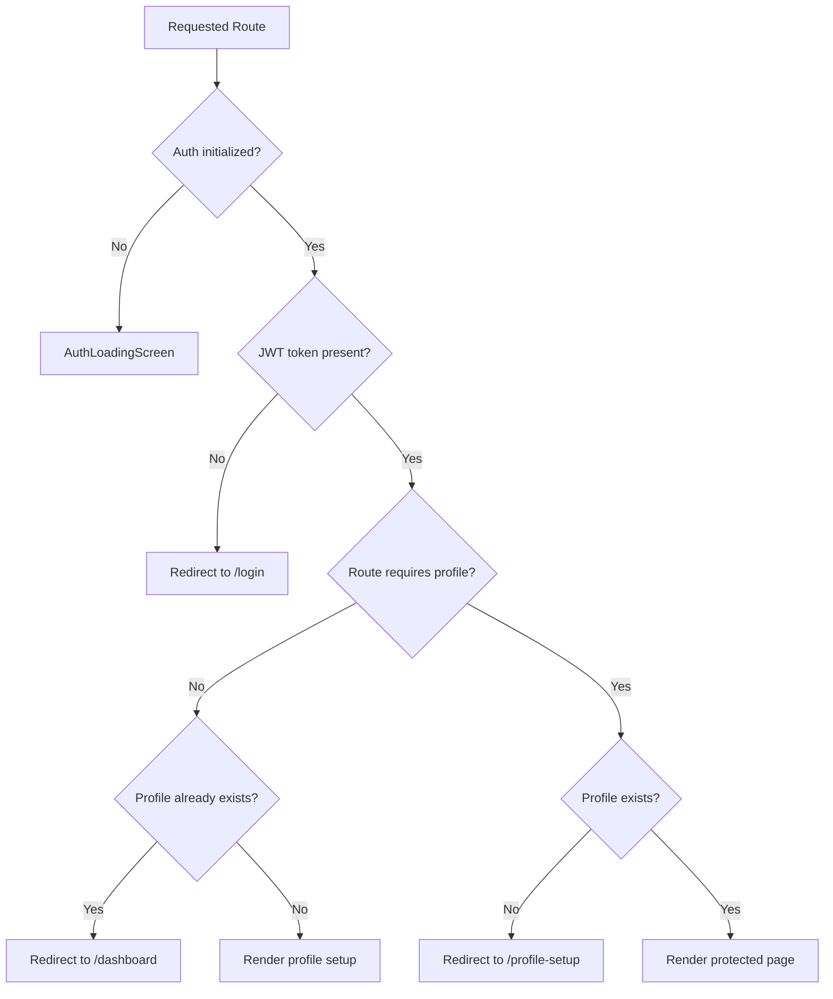

# Frontend Guide

This guide explains the LifeOS frontend implementation: routing, protected screens, API access, authentication state, real-time notifications, and source organization.

## Frontend Overview

The frontend is a React 18 single-page application built with Vite. It lives in `frontend/` and communicates with the backend through Axios REST clients and a STOMP WebSocket client.

Primary responsibilities include:

- Public authentication screens.
- Profile setup gating.
- Protected dashboard, tasks, notes, activity, profile, leaderboard, connections, and settings pages.
- API orchestration through feature-specific client modules.
- Real-time notification connection management.
- Reusable UI components and domain hooks.

## Source Structure

```text
frontend/src/
|-- api/             Axios client and REST API modules
|-- auth/            AuthContext, auth loading screen, and protected route guard
|-- components/      Feature-scoped UI components
|-- config/          Runtime API URL configuration
|-- features/        Feature service helpers
|-- hooks/           Reusable React hooks
|-- pages/           Route-level page components
|-- routes/          React Router route definitions
|-- services/        WebSocket, notifications, connections, and activity clients
|-- utils/           Constants, date helpers, validation, and UI utility logic
|-- App.jsx          BrowserRouter and route shell
|-- index.css        Tailwind and global CSS
`-- main.jsx         React DOM entrypoint
```

## Routing

Routes are defined in `frontend/src/routes/AppRoutes.jsx`.

| Route | Access | Purpose |
| --- | --- | --- |
| `/signup` | Public | Account creation. |
| `/login` | Public | Credentials login and Google sign-in entry. |
| `/oauth-success` | Public | Completes OAuth exchange-code flow. |
| `/profile-setup` | Authenticated, profile not required | Student profile onboarding. |
| `/dashboard` | Authenticated with profile | Main workspace. |
| `/tasks` and nested task/note routes | Authenticated with profile | Task workspace and task-attached notes. |
| `/notes/:noteId` | Authenticated with profile | Standalone note detail page. |
| `/profile` | Authenticated with profile | Student profile page. |
| `/activity` | Authenticated with profile | Activity and insight views. |
| `/leaderboard` | Authenticated with profile | Ranking views. |
| `/connections` | Authenticated with profile | Friend discovery and requests. |
| `/settings` | Authenticated with profile | Account/settings screen. |

Unknown routes redirect to `/signup`.

## Route Guards

`auth/ProtectedRoute.jsx` controls access based on authentication and profile state.



## Authentication State

`auth/AuthContext.jsx` owns frontend session state.

| State/Action | Purpose |
| --- | --- |
| `token` | Current JWT token. |
| `isAuthenticated` | Boolean derived from token presence. |
| `profile` | Current student profile data. |
| `hasProfile` | Whether the authenticated user has created a profile. |
| `profileChecked` | Whether profile lookup has completed. |
| `isInitialized` | Whether initial token loading has completed. |
| `setAuthFromToken(token)` | Saves a JWT to local storage and updates state. |
| `clearAuth()` | Removes the token and clears session/profile state. |
| `refreshProfileStatus()` | Fetches profile state and handles missing/invalid sessions. |

The token storage key is defined in `utils/constants.js` as `lifeos_jwt_token`.

## API Layer

The frontend centralizes HTTP behavior in `api/axiosClient.js`.

- `VITE_API_URL` supplies the backend base URL at build time.
- Requests attach `Authorization: Bearer <token>` when a token exists.
- JSON headers are configured by default.
- `401` and `403` responses clear local auth state and redirect to `/login`, except for login/registration flows where errors are passed back to the page.

Feature-specific API modules live in `frontend/src/api`, including task, label, notes, dashboard, profile, leaderboard, friends, stats, level, branch, and auth clients.

## WebSocket Notifications

`services/websocketService.js` creates the STOMP client. It derives the WebSocket endpoint from `VITE_API_URL`:

- `http://localhost:8080` becomes `ws://localhost:8080/ws`.
- `https://api.example.com` becomes `wss://api.example.com/ws`.

The client sends the JWT in the STOMP `CONNECT` headers and subscribes to:

```text
/user/queue/notifications
```

Incoming messages are parsed as JSON and passed to registered notification callbacks.

## Build and Runtime Configuration

Run locally:

```bash
cd frontend
npm install
npm run dev
```

Build for production:

```bash
cd frontend
npm run build
```

Required build variable:

```env
VITE_API_URL=https://<backend-domain>
```

The repository includes:

- `frontend/vercel.json` for SPA fallback rewrites on Vercel.
- `frontend/Dockerfile` for building static assets and serving them with Nginx.
- `frontend/nginx.conf` for React Router fallback routing.

## Related Documentation

- [System Architecture](architecture.md)
- [Authentication](authentication.md)
- [WebSockets](websocket.md)
- [API Guide](api.md)
- [Project Structure](project-structure.md)

## Conclusion

The frontend is intentionally thin around business rules. It owns user experience, routing, session state, API orchestration, and real-time subscriptions, while the backend remains responsible for persistence, authorization, and domain decisions.
