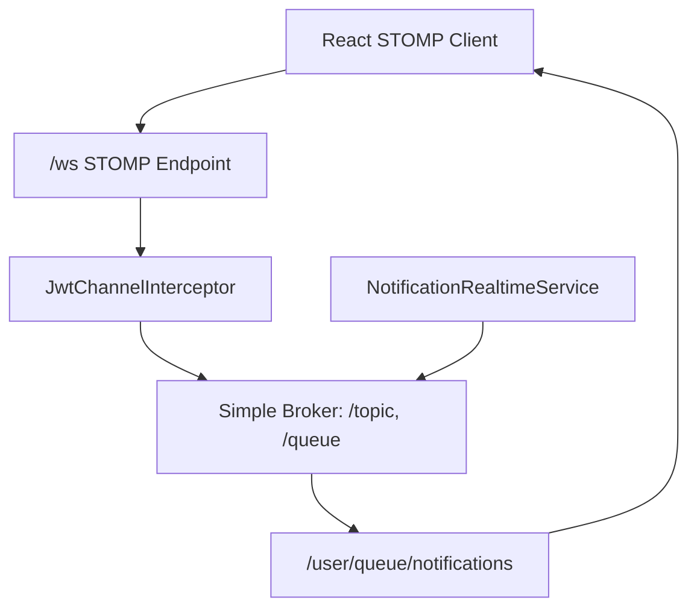
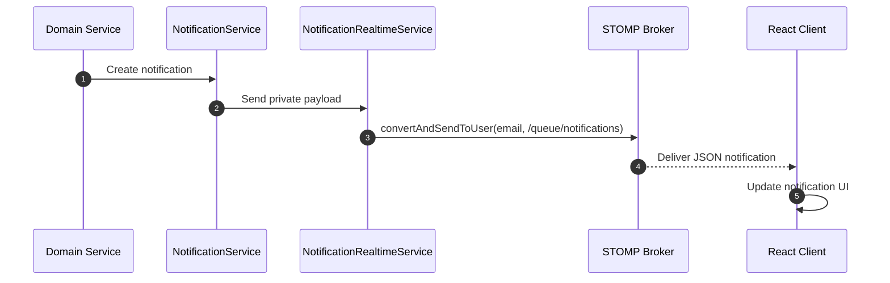

# WebSockets

This document explains the LifeOS real-time notification system: STOMP setup, connection authentication, private notification routing, frontend subscription behavior, and production considerations.

## Overview

LifeOS uses Spring WebSocket with the STOMP protocol to push user-specific notifications to active clients. REST remains the main API surface; WebSockets are used for real-time delivery of events such as social and notification updates.



## Backend Configuration

`websocket.WebSocketConfig` enables a STOMP message broker:

| Setting | Value |
| --- | --- |
| Endpoint | `/ws` |
| Allowed origin patterns | `*` at the WebSocket endpoint level |
| Simple broker prefixes | `/topic`, `/queue` |
| User destination prefix | `/user` |
| Inbound channel interceptor | `JwtChannelInterceptor` |

The application still uses normal backend CORS configuration for HTTP APIs. In production, reverse proxies must also allow WebSocket upgrades.

## Connection Lifecycle

```mermaid
sequenceDiagram
    autonumber
    participant FE as Frontend
    participant STOMP as STOMP Endpoint /ws
    participant Interceptor as JwtChannelInterceptor
    participant JWT as JwtService
    participant Details as UserDetailsService
    participant Broker as STOMP Broker

    FE->>STOMP: CONNECT with Authorization: Bearer token
    STOMP->>Interceptor: preSend CONNECT frame
    Interceptor->>JWT: Extract username and validate token
    Interceptor->>Details: Load user details
    Details-->>Interceptor: User details
    Interceptor->>STOMP: Attach authenticated principal
    STOMP-->>FE: CONNECTED
    FE->>Broker: SUBSCRIBE /user/queue/notifications
```

If the token is missing, blank, invalid, or expired, the interceptor returns `null`, preventing the WebSocket connection from being established.

## Frontend Client

The frontend client lives in `frontend/src/services/websocketService.js`.

It derives the broker URL from `VITE_API_URL`:

| API URL | WebSocket URL |
| --- | --- |
| `http://localhost:8080` | `ws://localhost:8080/ws` |
| `https://api.example.com` | `wss://api.example.com/ws` |

The client passes the token in STOMP connect headers:

```javascript
connectHeaders: {
  Authorization: `Bearer ${token}`
}
```

After connection, it subscribes to:

```text
/user/queue/notifications
```

Messages are parsed from JSON and forwarded to UI callbacks.

## Notification Flow

`NotificationRealtimeService` uses `SimpMessagingTemplate` to send private payloads:

```java
messagingTemplate.convertAndSendToUser(
    recipient.getEmail(),
    "/queue/notifications",
    notificationResponseDto
);
```

Spring resolves the destination to the authenticated user's `/user/queue/notifications` subscription.



## STOMP vs Polling

The current design uses WebSockets for real-time delivery rather than asking the frontend to repeatedly poll notification endpoints. This reduces repeated HTTP traffic and makes social updates feel immediate when a user is online. Persisted notification endpoints still matter for initial load, unread counts, read-state changes, and recovery after reconnects.

## Production Considerations

- Use HTTPS for the frontend and backend so browser clients can connect with `wss://`.
- If a reverse proxy sits in front of the backend, it must forward upgrade headers.
- The current broker is Spring's simple in-memory broker. A durable external broker would be a future scaling option if notification volume or multi-instance delivery requirements grow.
- Ensure `VITE_API_URL` points to the public backend origin, because browser WebSocket connections are made from the user's machine, not from inside Docker's internal network.

## Related Documentation

- [System Architecture](architecture.md)
- [Authentication](authentication.md)
- [Frontend Guide](frontend.md)
- [Deployment](deployment.md)
- [Engineering Decisions](engineering-decisions.md)

## Conclusion

LifeOS keeps real-time messaging focused and lightweight. REST remains the primary source of truth, while STOMP WebSockets provide authenticated private notification delivery for active clients.
